# Access to the Workshop Environment

The purpose of this exercise is to ensure you have access to the workshop environment for the day.

# Fundamentals

The following verifications are fundamentals to being able to participate in the workshop. The environment will be provided to you for the day of the workshop. At the end of the workshop, the environment will be deleted.

## 1. Sign In to the Azure Portal and Set Up MFA

Azure requires all accounts to sign in with MFA (multi-factor authentication). For this workshop, you will need to set up MFA access for your temporary account.

Please follow the instructions below carefully.

1. Navigate in your web browser to [https://portal.azure.com/](https://portal.azure.com/auth/login/)

   - Note: If you are already logged in with a different account, please sign out -- click on your photo in the upper right corner, and then select Sign out.

2. Sign in with the username and password you received at the workshop.
3. Next, create a new password.
4. Type the password you have received in the workshop as the current password

   - Type your new password and confirm it again.
   - **Very important:** Please remember it or write it down for the day.

   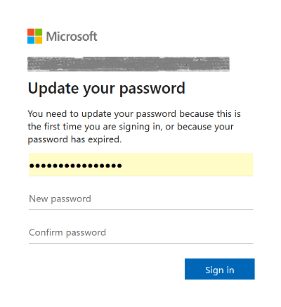

5. Click on Next at the Let's keep your account secure page

   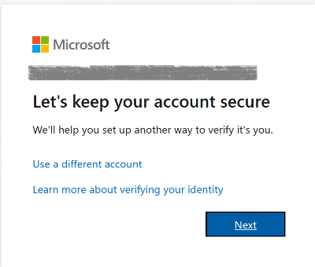

6. Install Microsoft Authenticator on your phone by using Google Play or App Store. Click Next.

   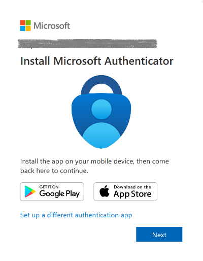

7. The security QR code will be shownon the screen

   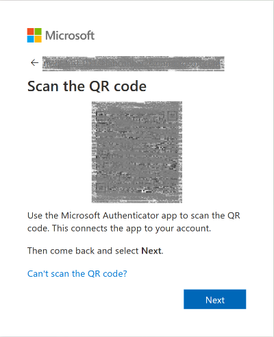

8. On your phone, open Microsoft Authenticator app, and click on + in the upper right corner

   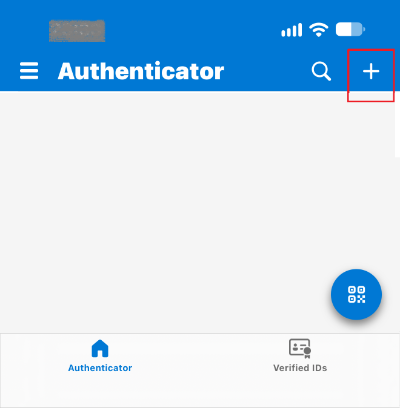

9. Select Work or school account, then select Scan QR code

   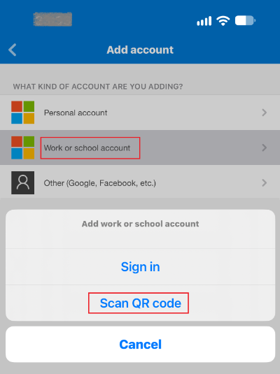

10. Then scan the QR code shown on the scren of your laptop

    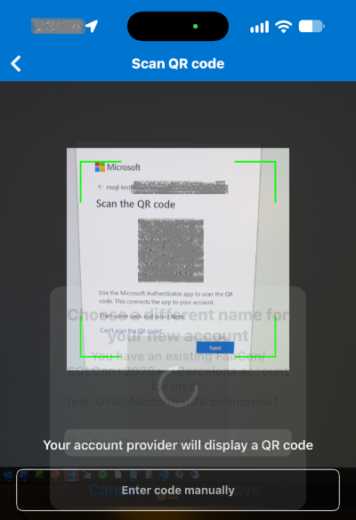

    - Upon successful scanning, your account will be added and a 6-digit security code will be generated every 30 seconds
    - Click Next on the laptop with the QR code screen.

      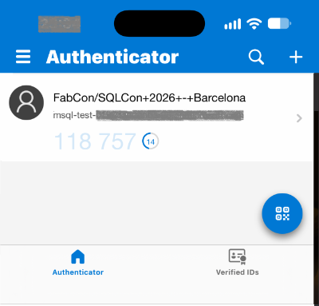

11. Type in the 6-digit code generated in the phone app. Click Next.

    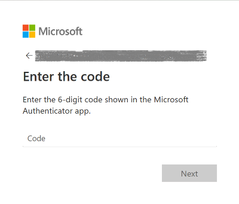

   > [!NOTE]
    >
    > The authenticator app on your phone generates a different 6-digit code every 30 seconds, providing an additional layer of access security for your Azure account.

12. Successful addition of the authenticator code will display Authenticator Added screen. Click on Done.

    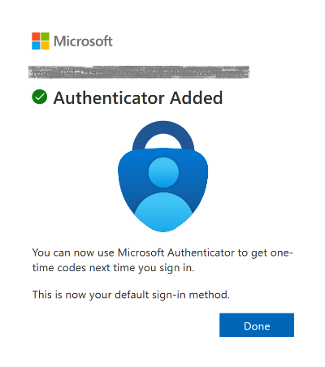

    - Congratulations, you have just secured your Azure account with multi-factor authentication.

13. On the next screen confirm Yes to stay signed in. For the purpose of the workshop this will avoid multiple re-logins throughout the day.

    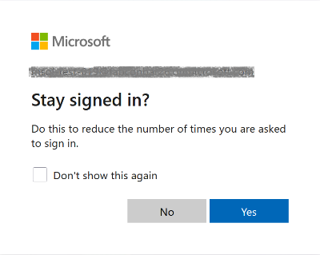

Next, you will be greeted by Azure Portal home welcome screen.

These steps conclude enabling access to Azure portal

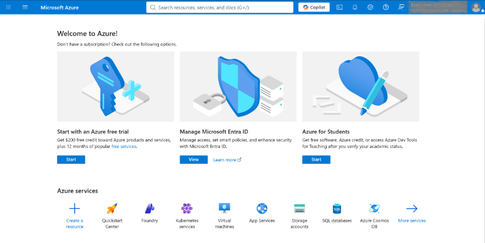

### Validation (optional)

Optionally, if there is time, you can log out by clicking on the person icon in the upper right corner and clicking Sign out. You will need to follow the same steps if you are automatically logged out from Azure, which is automated after a long time of inactivity.

1. Sign in again at [https://portal.azure.com/](https://portal.azure.com/auth/login/) with the username provided for the workshop and the new password you set. You will also be asked to enter the authenticator app code.
2. Open the app on your phone and type in the new 6-digit code and click on Verify.
3. Using the combination of your username, password and a 6-digit code generated from the authenticator app you can access the Azure portal.

   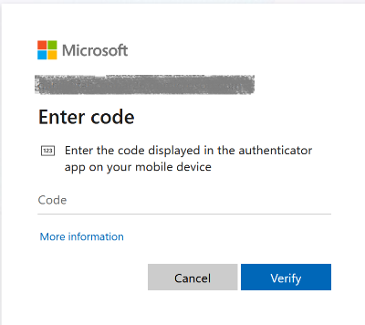

## 2. Access shared Azure Portal dashboard

Next, let's navigate you to use the shared portal dashboard

1. In the Azure Portal, in the upper right corner click on the three horizontal lines

   

2. Click on the Dashboard

   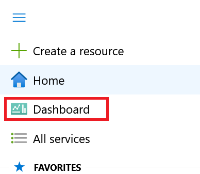

3. Click on the drop-down chevron, wait for a bit, and click on Tutorial E, SQL Con Barcelona

   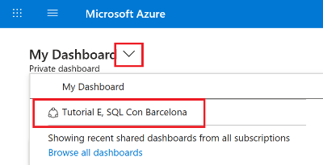

   > [!NOTE]
   >
   > - In case Tutorial E shared dashboard is not showing up, click on Browse all dashboards to find it.
   > - Alternatively refresh the browser page.

- With this you will access a shared Azure dashboard for the tutorial where we have pinned the resources provisioned for the workshop.
- In the screenshot shown below, please notice the SQL Server and Azure SQL Managed Instance resources you will need in the next steps.

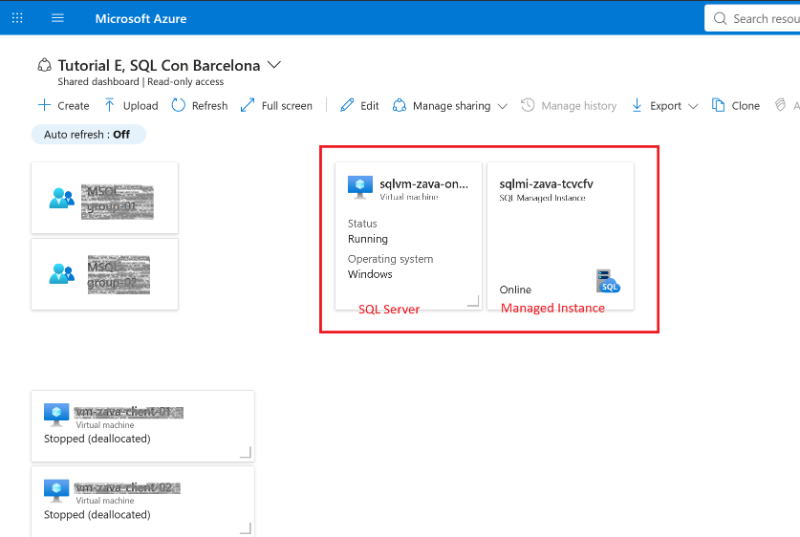

## 3. Sign In to SQL Server

1. Click on the SQL Server resource in Azure portal.

   - With this you will access the SQL Server in Azure VM overview page.

2. On the right-hand side of the screen, locate the DNS name, and click on Copy to clipboard to copy the server endpoint

   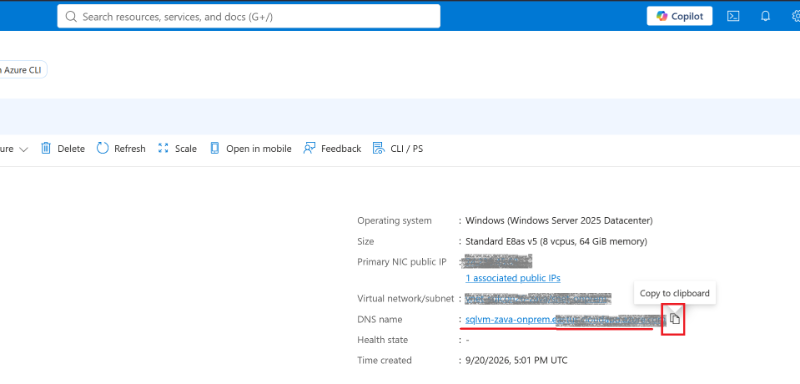

3. Open SSMS, and click on the Connect Object Explorer button (or alternatively click on File in the menu, then Connect Object Explorer)

   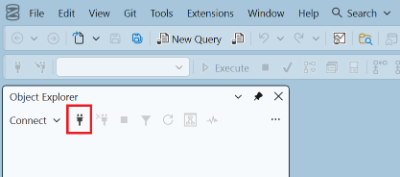

Populate the Connect to Server dialog with these values:

- In the field Server name, paste the DNS name (SQL Server connection endpoint) from the previous step
- For Authentication type, on the drop-down menu choose SQL Server Authentication
- Type in the username and password provided to you in the workshop
- Encryption needs to be set to Mandatory
- Enable check-box Trust Server Certificate
- Click on Connect

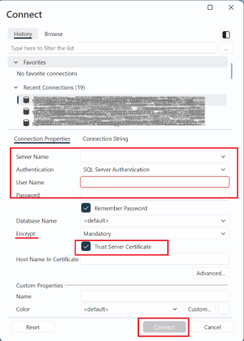

Congratulations! You are now connected to the SQL Server we will be using in the workshop.

1. Optionally, execute the following query in SSMS to check the SQL server version

```sql
SELECT @@SERVERNAME AS ServerName, @@VERSION AS SQLServerVersion, DB_NAME() AS CurrentDatabase;
```

## 4. Sign In to Azure SQL Managed Instance

Next, let's do the same as the above for Azure SQL Managed Instance.

1. Click on the Managed Instance resource in Azure portal (step shown above).

   - With this you will access the Azure SQL Managed Instance overview page.

2. On the right-hand side of the screen, expand the Security menu
3. Click on the Networking menu item
4. Locate the Endpoint field, and on the right-hand side click on the icon to copy to clipboard

   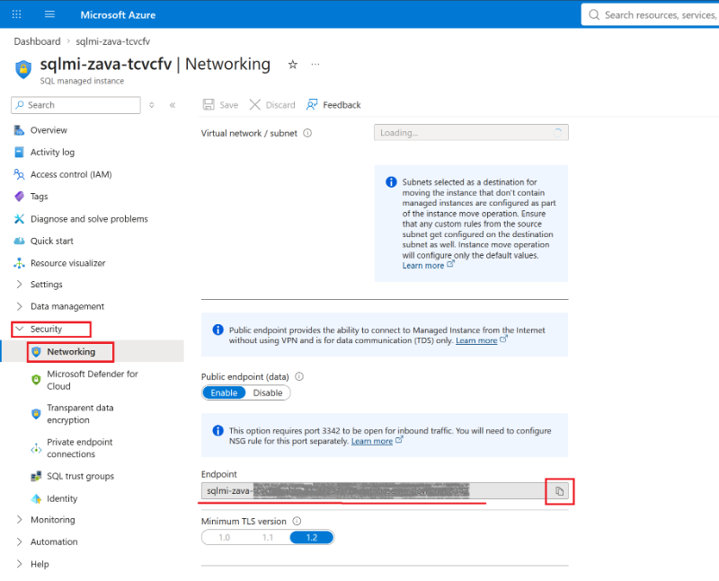

   > [!NOTE]
   >
   > - For the purpose of this workshop, we are using a public endpoint to connect to Azure SQL Managed Instance. This option is not enabled by default and must be enabled after the SQL managed instance is provisioned.
   > - For production environments, a more secure approach is to connect to Azure SQL Managed Instance using a VPN and a private endpoint.

5. Open SSMS, and click on the Connect Object Explorer button (or alternatively click on File in the menu, then Connect Object Explorer)

   

6. Populate the Connect to Server dialog with these values:

   - In the field Server name, paste the Endpoint name (Managed Instance connection endpoint) from the previous step
   - For Authentication type, on the drop-down menu choose SQL Server Authentication
   - Type in the username and password provided to you in the workshop
   - Encryption needs to be set to Mandatory
   - Enable check-box Trust Server Certificate
   - Click on Connect

     

   Congratulations! You are now connected to the Azure SQL Managed Instance we will be using in the workshop.

7. Optionally, execute the following query in SSMS to check the SQL server version

```sql
SELECT @@SERVERNAME AS ServerName, @@VERSION AS SQLServerVersion, DB_NAME() AS CurrentDatabase;
```

Congratulations! You are now connected to the Azure SQL Managed Instance we will be using in the workshop.

> [!IMPORTANT]
>
> Proceed with the **Advanced Exercises** only if you have time remaining within the allocated 15 minutes. Otherwise, try them at home or at a later time.

# Advanced (Optional)

As a prerequisite for this workshop, you were asked to set up GitHub Copilot with SSMS and Visual Studio Code for advanced exercises before arriving at the workshop.

## 1. Test GitHub Copilot in SSMS

Please use SSMS 22.10 or higher for the exercise.

In case you have not installed the Copilot extension

1. In the upper right corner click on the arrow down
2. Click on Install Copilot

   

3. Confirm installation of GitHub Copilot in the Visual Studio Installer. Click on Install.

   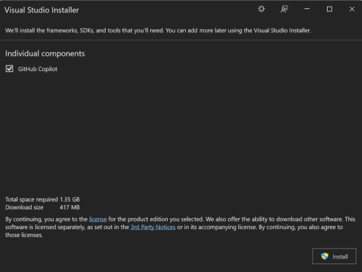

4. Once GitHub Copilot extension is installed, click on Refresh credentials which will launch a GitHub web page

   - Login to GitHub and select the account.
   - In case you have several accounts, select the account that has an active Copilot subscription.

   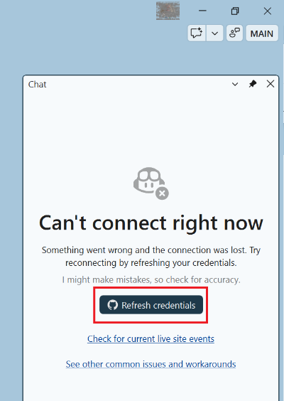

5. Ask Copilot to generate a sample T-SQL query, for example, "Create a T-SQL query that lists all databases on this SQL Server instance, including database name, state, recovery model, compatibility level, and creation date. Sort by database name."

   - A successful response will look similar to the following screenshot:

   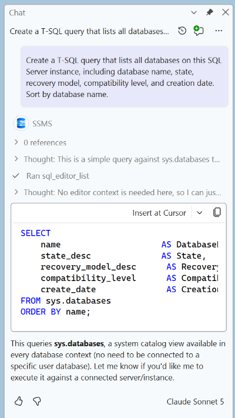

## 2. Test GitHub Copilot in VS Code

- Ensure that GitHub Copilot is configured in VS Code by following these instructions: [https://code.visualstudio.com/docs/setup/copilot#_set-up-github-copilot](https://code.visualstudio.com/docs/setup/copilot#_set-up-github-copilot)
- Check if Python is installed on the machine using the prompt "Check if Python is installed on this machine."

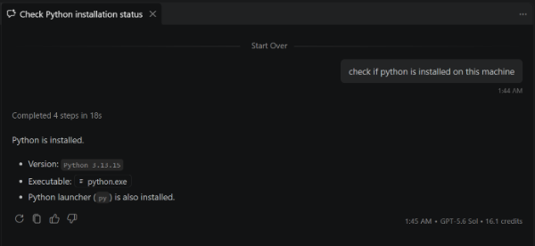

- Check if Azure CLI is installed on this machine
- If you are missing Python or Azure CLI, install it with the help of Copilot by using the prompt "Install Python on this machine" or "Install Azure CLI."
- Once you have Python and Azure CLI on the machine, you can ask Copilot to do something more complex. For example, prompt it with "Connect to my Azure account. If authentication is required, launch an external web browser so I can sign in. Then list all Virtual Machines and Managed Instances in my Azure subscription."
  - Copilot will use Azure CLI commands to work out the resources on our instance
- Example output for our workshop resources would show something like the below

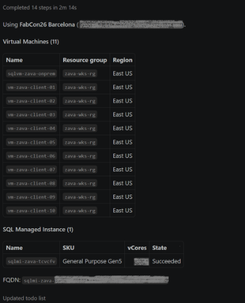

- This advanced example demonstrates how GitHub Copilot in Visual Studio can be used to query Azure resources.

> [!NOTE]
>
> The above **Advanced Exercise** might take longer than the time allocated for this section. **Use your time wisely and proceed only if you have time remaining. Otherwise, try it at home or at a later time.**

# What's next

Congratulations! 🎉

You secured your workshop account with multi-factor authentication, connected to the workshop SQL Server and Azure SQL Managed Instance, and confirmed that the environment is ready for the hands-on exercises. If you completed the advanced exercise, you also used GitHub Copilot to inspect Azure resources.

Next, continue to [Module 2 - Migrate to Azure](../Module%202%20-%20Migrate%20to%20Azure/README.md).
