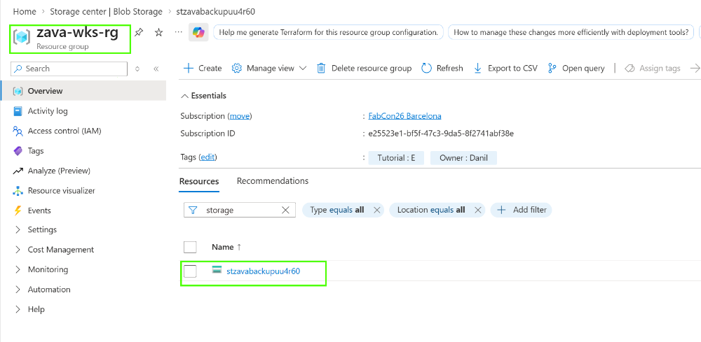
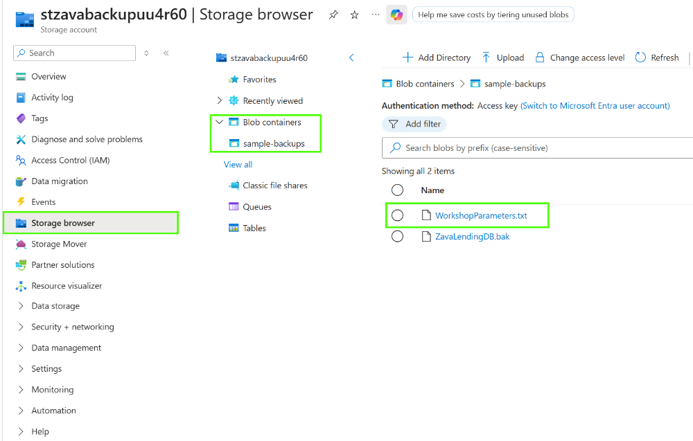
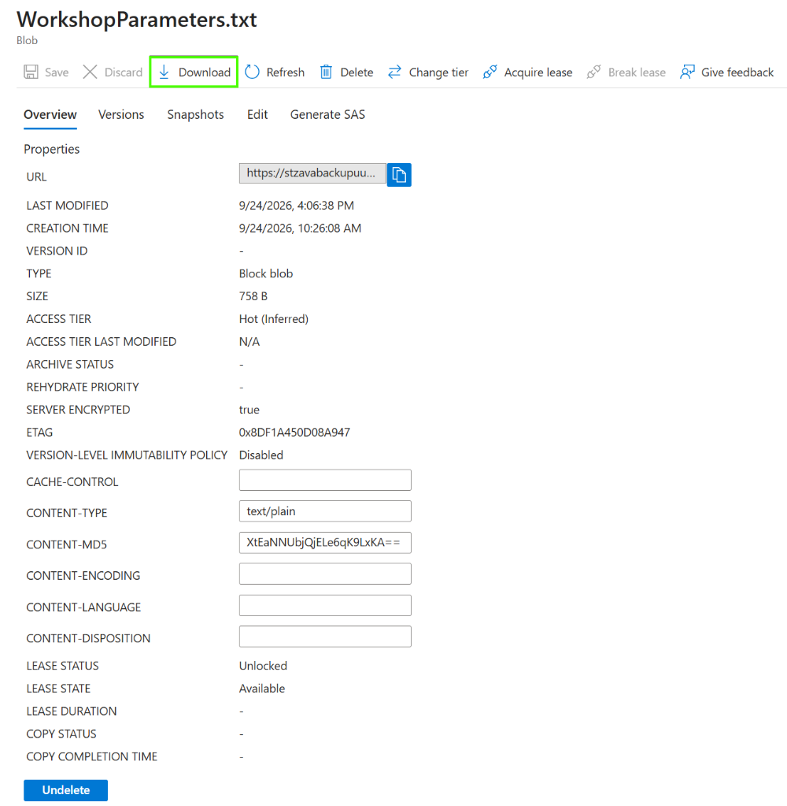

# How to access shared secrets and configuration parameters

All shared configuration and access parameters for this workshop are stored on dedicated Azure Storage Account.

### List of parameters

Below is the list of parameters that are available in **WorkshopParameters.txt** file.

| Parameter                            | Where it is needed                                                                                     |
| ------------------------------------ | ------------------------------------------------------------------------------------------------------ |
| **Username for SQL resource**      | Allows SQL auth to SQL VM/MI/Hyperscale resources. Used in all modules.                                |
| **Password for SQL user**            | Allows SQL auth to SQL VM/MI/Hyperscale resources. Used in all modules.                                |
| **Username for helper client VMs**   | Allows auth to client Azure VMs (in case access from local machine does not work. Used in all modules. |
| **Password for helper client VMs**   | Allows auth to client Azure VMs (in case access from local machine does not work. Used in all modules. |
| **Azure Open AI endpoint**           | Address of Wzure Open AI endpoint. Used in Module 3 and Module 5.                                      |
| **Azure Open AI API Key**            | Secret for accessing Open AI enpodint. Used in Module 3 and Module 5.                                  |
| **Fabric Evenstream - HubNamespace** | Used to populate @HubNamespace parameter in enable-ces.sql in Module 5.                                |
| **Fabric Evenstream - HubName**      | Used to populate @HubNameparameter in enable-ces.sql in Module 5.                                      |
| **Fabric Evenstream - KeyName**      | Used to populate @KeyName parameter in enable-ces.sql in Module 5.                                     |
| **Fabric Evenstream - PolicyKey**    | Used to populate @PolicyKey parameter in enable-ces.sql in Module 5.                                   |
| **Fabric Event Hub connection string** | Used to populate parameters in the .env file for CustomerSupportApp in Module 5, Exercise 05.        |
| **Fabric Event Hub consumer group**  | Used to populate parameters in the .env file for CustomerSupportApp in Module 5, Exercise 05.          |

### How to access file with configuration

- Open Azure Portal (make sure you are signed in the workshop tenant with given credentials).
- Search for **zava-wks-rg** resource group and select **stzavabackupuu4r60**.

- Select **Storage browser,** then **Blob containers** and choose **sample-backups**.

- Click on **WorkshopParameters.txt **and download it to your local / working machnine.
- 
