# Migrate from SQL Server to Azure

This hands-on module will teach you how to assess your SQL Server databases for migration readiness and migrate them to Azure SQL Managed Instance.

## Excercies

The following excercises are available in this module:

1. Exercise 1 (**Optional**): Assess the SQL Server databases for migration readiness
  - In case you have the Hybrid and Migration extension installed in SSMS: Run an Azure migration readiness assessment from SSMS and review compatibility, sizing, and estimated cost.
  - For assessment of recommended SKUs in Azure, databases the assessment is performed on must have at least 7 days of active workload
  - This operation takes about 10+ minutes to complete
2. **Exercise 2 (Main)**: Configure and Validate a Managed Instance Link (online migration)
  - Migrate a database from SQL Server to Azure SQL Managed Instance using MI link wizard in SSMS for near-real time and minimum downtime migration
3. Exercise 3 (**Bonus**): Migrate with Log Replay Service (online migration)
  1. Migrate a database from SQL Server to Azure SQL Managed Instance using log shipping via Log Replay Service (LRS)
4. Exercise 4 (**Bonus**): Native Backup and Restore with Azure Blob Storage (offline migration)
  1. Restore database from your SQL Server to Azure SQL Managed Instance

By the end of the module, you will have:

- Optionally run an Azure migration readiness assessment from SSMS and review compatibility, sizing, and estimated cost.
- Configured a Managed Instance link in SSMS.
- Validated replication and read/write roles before and after planned failovers.
- Completed the migration and identified the remaining application and server-level cutover work.
- Compared Managed Instance link with LRS and identified when each migration method is appropriate.

# Exercise 1 (Optional): Assess the SQL Server database for migration

> [!IMPORTANT]
> This step takes about 10 minutes. Consider starting it **beforehand**, or skip directly to **Exercise 2: Migration with MI link**.  
> Alternatively
> - Watch the [YouTube video on database assessments](https://youtu.be/u1dJHCkp-mA?si=2_Q4VEzr3YUicFnZ).
> - View a pre-generated sample report: [HTML report](https://improved-adventure-l62jq57.pages.github.io/SqlAssessment-sqlzavaonprem-202609241419.html) | [PDF report](./assets/SqlAssessment-sqlzavaonprem-202609241419.pdf).

> [!NOTE]
> Exercise 1 is optional and is available only to attendees who have the Hybrid and Migration extension installed. If the component is missing and you cannot install it during the workshop, skip this exercise, continue directly to Exercise 2, and complete the assessment at home after installing the extension. The Managed Instance link wizard excercise does not require this extension.

## Module Prerequisite: Hybrid and Migration extension in SSMS

Connect to the workshop SQL Server in SSMS, right-click the top-level server node in **Object Explorer**, and confirm that **Migrate SQL Server** is available.

If Migate to SQL Server is not available, then install it by following these steps:

1. Close SSMS.
2. Open **Visual Studio Installer** from the Windows Start menu.
3. Locate **SQL Server Management Studio 22**, and then select **Modify**.
4. On the **Workloads** tab, select **Hybrid and Migration**.
5. Select **Install while downloading**, and then select **Modify**.
6. When the installation finishes, select **Launch**.
7. Connect to the workshop SQL Server in SSMS, right-click the top-level server node in **Object Explorer**, and confirm that **Migrate SQL Server** is available.

If **Migrate SQL Server** is already available, the workload is installed and no modification is required.

## Assess a database for migration

Always assess the source before selecting a destination or migration technology. Compatibility findings show what must be remediated, while representative performance history is needed to recommend a service tier and size that can meet the workload requirements without unnecessary cost.

This workshop uses the **Migrate SQL Server** component introduced in SSMS 22.5. For the current Microsoft procedure, see [Migrate SQL Server to Azure SQL with SSMS](https://learn.microsoft.com/ssms/migrate/migrate-sql-server-azure-sql).

## 1. Open the Migration Landing Page

1. In SSMS, connect to the workshop **SQL Server** with the credentials supplied by the instructor.
2. In **Object Explorer**, right-click the top-level SQL Server instance node.
3. Select **Migrate SQL Server**.

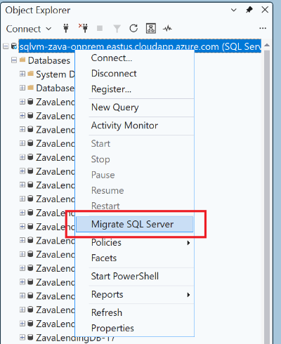

4. Confirm that the **Migration** landing page opens at the **Database Assessment** phase.

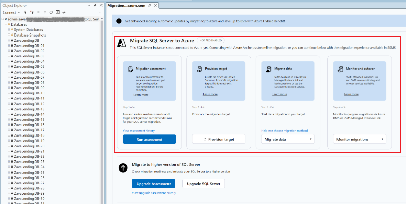

The assessment reads source metadata and reports compatibility; it does not change or migrate the source databases.

## 2. Run or View the Readiness Assessment

The action shown on the landing page depends on whether the source SQL Server is enabled by Azure Arc.

For the porpose of the workshop, we are using SQL Server that is not enabled by Azyre Arc.

### SQL Server Not Enabled by Azure Arc

Each attendee has an assigned database named `ZavaLendingDB-No`.

Replace `No` in every instruction and script with your assigned workshop database number. For example, attendee 07 uses `ZavaLendingDB-07`. Do not run the exercises against another attendee's database.

1. Select **Run readiness assessment**.
2. Wait for SSMS to inspect the instance and its user databases.
3. When the assessment finishes, open the generated HTML report.
4. Locate your assigned `ZavaLendingDB-No` database and review each available target:
  **Azure SQL Database**  
   **Azure SQL Managed Instance**  
   **SQL Server on Azure Virtual Machines**
5. Review the target recommendation and every compatibility finding.

The local SSMS assessment is metadata-based. It recommends a target by considering blocking issues and the amount of manual migration work, but it does not have long-term workload telemetry for accurate performance-based sizing.

> [!IMPORTANT]
> Performance data is essential for sizing and cost estimate. Our databases on the demo environment do not have a sifniciant load on them, so they are not representative for showing cost and size estimates. A metadata-only scan can identify compatibility, but it cannot show whether the workload needs a larger or smaller Azure configuration. In production, please remember to collect representative performance history before approving the destination and budget.

## 3. Record the Assessment Result

For your `ZavaLendingDB-No` database, record the following values before continuing:

> [!NOTE]
> The **Recommended service tier and SKU** and **Estimated monthly cost** will be populated only for databases that have had an active workload for at least the past seven days.

| Assessment item                      | Your result |
| ------------------------------------ | ----------- |
| Recommended Azure target             |             |
| Azure SQL Managed Instance readiness |             |
| Recommended service tier and SKU     |             |
| Estimated monthly cost               |             |
| Compatibility warnings or blockers   |             |

Interpret the readiness state as follows:

- **Ready:** no migration blockers were detected for the selected target.
- **Ready with warnings:** migration can proceed, but you must review and test the nonblocking findings.
- **Not ready:** remediate the reported blockers before migrating to that target.

For this workshop, continue only after Azure SQL Managed Instance is shown as **Ready** or **Ready with warnings**, and you understand any warnings. The provided target Managed Instance is already provisioned for the exercise.

## 4. Select Managed Instance Link

1. Return to the SSMS **Migration** landing page.
2. In the migration phase, select **Migrate data**.
3. Review the available migration methods. Depending on the source and target, the page can offer:
  **SQL Managed Instance link** for continuous near-real-time replication and minimum downtime.  
   **Backup and restore** when a planned outage is acceptable.  
   **Azure Database Migration Service** for managed online or offline migration scenarios.
4. Select **SQL Managed Instance link**.
5. Continue to Exercise 2 to configure the link for your assigned database.

> [!NOTE]
> The assessment recommends a destination; recovery objectives, acceptable downtime, network connectivity, operational requirements, and migration complexity determine the migration method. We select Managed Instance link because this exercise requires an online migration with a reversible SQL Server 2022 cutover.

# Exercise 2 (Main): Configure and Validate a Managed Instance Link

## Managed Instance Link Overview

The [Managed Instance link](https://learn.microsoft.com/azure/azure-sql/managed-instance/managed-instance-link-feature-overview) uses distributed availability groups to replicate a database in near real time between SQL Server and Azure SQL Managed Instance. The source workload can remain online while changes are continuously synchronized, so application downtime is limited primarily to the final planned cutover.

The supported behavior depends on the SQL Server version:

- **SQL Server 2016, 2017, and 2019:** one-way replication from SQL Server to Azure SQL Managed Instance. Failing over to Managed Instance removes the link, and failback is not supported.
- **SQL Server 2022 and later:** replication can start in either direction, and the link supports bidirectional planned failover between SQL Server and Azure SQL Managed Instance. This enables both minimum-downtime migration and disaster recovery with failback to SQL Server.

For SQL Server 2022 bidirectional failover, the Azure SQL Managed Instance must use the matching **SQL Server 2022** update policy. An instance that uses the **Always-up-to-date** policy can receive a link from SQL Server, but it cannot replicate back or fail back to SQL Server 2022 after failover. Learn more about [update policies in Azure SQL Managed Instance](https://learn.microsoft.com/azure/azure-sql/managed-instance/update-policy).

> [!IMPORTANT]
> Managed Instance link replicates user databases, not system databases or instance-level objects. SQL logins, SQL Server Agent jobs, credentials, linked servers, and other server-level configuration must be assessed, scripted, and migrated separately. Preserve login security identifiers (SIDs) where required to avoid orphaned database users.

## 1. Identify Your Workshop Database

Each attendee has an assigned database named `ZavaLendingDB-No`.

Replace `No` in every instruction and script with your assigned workshop database number. For example, attendee 07 uses `ZavaLendingDB-07`. Do not run the exercises against another attendee's database.

> [!IMPORTANT]
> You must connect directly to your assigned `ZavaLendingDB-No` database. **Do not connect to another attendee's database.**

## 2. Verify the Prerequisites

**The workshop environment is prepared in advance**. Skip to the next step.

To use MI link outside of the workshop, or for a production deployment, follow [Prepare your environment for a Managed Instance link](https://learn.microsoft.com/azure/azure-sql/managed-instance/managed-instance-link-preparation) before continuing.

- You can connect to both the workshop SQL Server and Azure SQL Managed Instance in SSMS.
- You are using SSMS 22.10 or later. The latest SSMS release is recommended. The **Hybrid and Migration** workload extension is not required for the Managed Instance link wizard.
- The source is a supported version of SQL Server with the required cumulative update.
- Always On availability groups are enabled on SQL Server.
- The network and certificate prerequisites were prepared by the workshop instructor.
- The source database uses the full recovery model and has a current full backup.
- For two-way failover with SQL Server 2022, the managed instance needs to have a matching **SQL Server 2022** update policy. Similarly, for two-way failover with SQL Server 2025, the managed instance needs to have a matching **SQL Server 2025** update policy.

Run this query on SQL Server to record the workshop build. SQL Server 2022 RTM and later can create a link with SQL Server as the initial primary. Keep production instances on a currently supported servicing update. SQL Server 2022 CU10 or later is required only when Managed Instance is the initial primary.

```sql
SELECT
	SERVERPROPERTY('ProductVersion') AS ProductVersion,
	SERVERPROPERTY('ProductLevel') AS ProductLevel,
	SERVERPROPERTY('Edition') AS Edition,
	SERVERPROPERTY('IsHadrEnabled') AS IsAlwaysOnEnabled;
GO
```

Confirm that `IsAlwaysOnEnabled` returns `1` before continuing.

## 3. Create the Link in SSMS

If the **New Managed Instance link** wizard opened when you selected the migration method in Exercise 1, continue below starting at step 4. Otherwise, open it directly from Object Explorer (steps 1-3).

1. Open SSMS and connect to the workshop **SQL Server**. This is the initial primary replica.
2. In **Object Explorer**, expand **Databases**.
3. Right-click your `ZavaLendingDB-No` database, point to **Azure SQL Managed Instance link**, and select **New**.

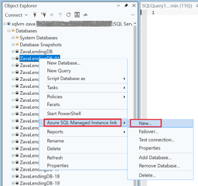

4. On **Introduction**, select **Next**.
5. On **Specify Link Options**:

- Enter a unique link name, such as `zavadb-link-No`. Replace `No` with the number of your database. **Each MI link needs to have a unique name**.
- **Uncheck** the **"The link will be used for bi-directional failover"** option. This is because the Managed Instance used in this workshop has the **Always-up-to-date** update policy configured, which does not support failback in this configuration.
- Select **Next**.

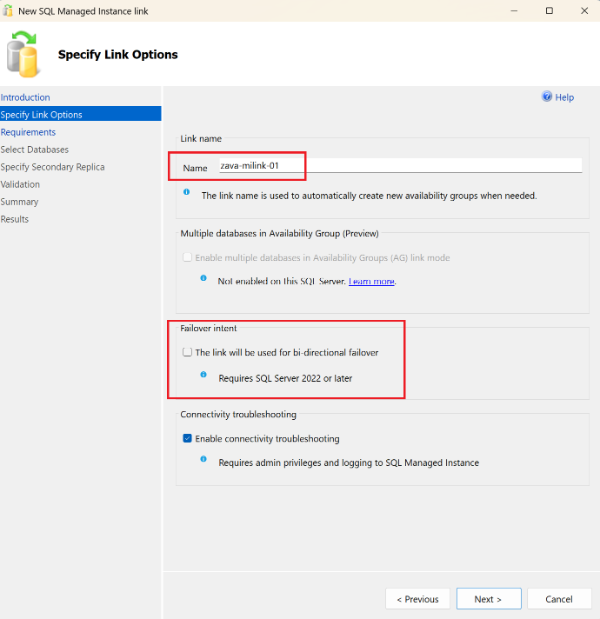

6. On **SQL Server Requirements**, wait for validation to finish. Resolve any failed requirement and select **Re-run Validation**. When all requirements pass, select **Next**.
7. On the **Select Databases** screen, we see missing requirements.

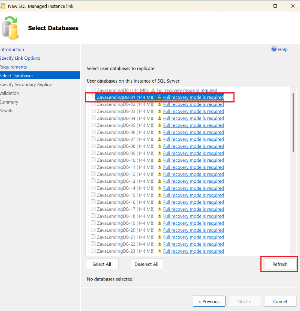

> [!TIP]
> The database requirements were not configured in advance, as this is a part of the excercise.

8. Set the full recovery model on the database, and create a full backup
  - In the script below, replace the `ZavaLendingDB-No`with the exact database name assigned to you
  - Run the script below SQL Server to set your database to full recovery model and take backup. Use exact database assigned to you , please do not use other attendee's database.

```sql
-- This script sets the full recovery model and takes a full database backup
-- Change ZavaLendingDB-No in the next line to the database assigned to you

DECLARE @DatabaseName sysname = N'ZavaLendingDB-No';
DECLARE @BackupDirectory nvarchar(4000) =
    CONVERT(nvarchar(4000), SERVERPROPERTY('InstanceDefaultBackupPath'));
DECLARE @BackupPath nvarchar(4000);
DECLARE @Sql nvarchar(max);

SET @BackupPath =
    @BackupDirectory
    + CASE WHEN RIGHT(@BackupDirectory, 1) IN (N'\', N'/')
           THEN N'' ELSE N'\' END
    + @DatabaseName + N'.bak';

SET @Sql =
    N'ALTER DATABASE ' + QUOTENAME(@DatabaseName) + N' SET RECOVERY FULL;';

EXEC sys.sp_executesql @Sql;

BACKUP DATABASE @DatabaseName
    TO DISK = @BackupPath
    WITH INIT, CHECKSUM, STATS = 10;
```

9. Click **Refresh** the view on the Database Select page of MI link wizard in SSMS
10. When you database shows without any errors, select your `ZavaLendingDB-No` database, and then select **Next**.

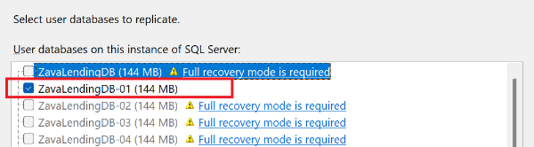

11. On **Specify Secondary Replica**, select **Add secondary replica**.

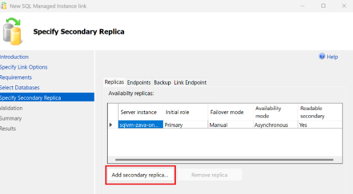

12. Sign in to Azure with your workshop account
  - If you are logged in under another account, click on Change User, and then go through the process of logging in with the credentials provided for the workshop
13. For **tenant**, select the FabCon/SQLCon 2026 tenenat
14. For **subscription**, select FabCon26 Barcelona
15. For **resource group**, select zava-wks-rg
16. Select **Managed Instance**: sqlmi-zava-tcvcfv
17. Enable check-box **Use public endpoint**

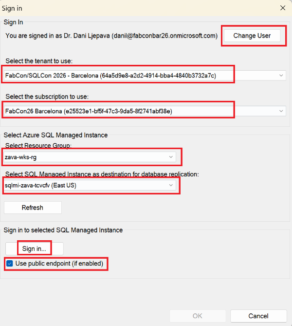

18. Select **Sign in**. On the Connect to Server prompt:
  - For **Authentication** select **SQL Server Authentication** mode
  - Type in credentials to login to Azure SQL Managed Instance provided in the workshop
  - For **Encryption** select **Mandatory** and enable **Trust server certificate**
  - Click **Connect**

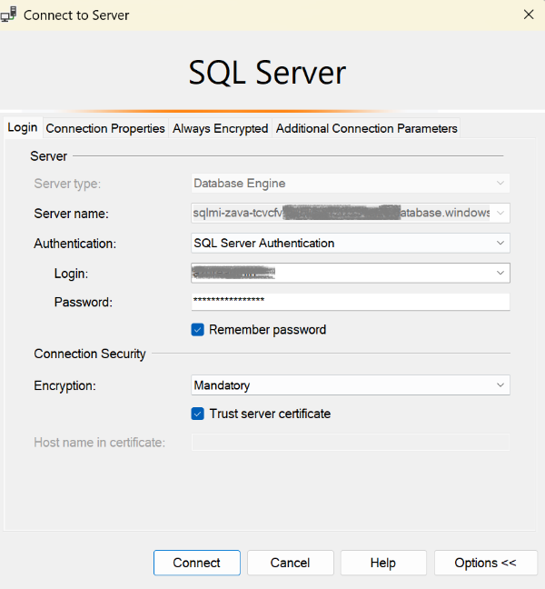

19. Confirm that **Login successful** is displayed, and click **Ok **to proceed.

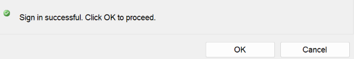

20. Select **OK** to return to the wizard. Ensure the Managed Instance shows as a secondary replica.

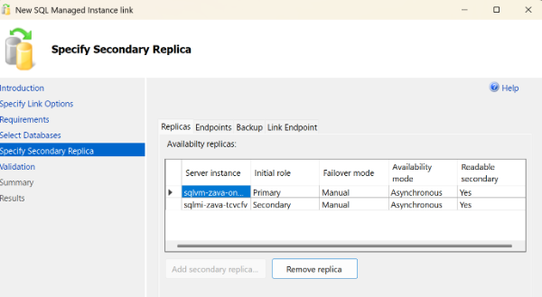

21. Review the endpoint and backup settings, and then select **Next**.
22. On **Validation**, confirm that every check succeeds, and then select **Next**.

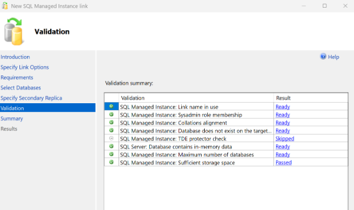

> [!NOTE]
> Skipped TDE protector requirement is Ok in this case, as for the workshop we are not using an encrypted database.

23. On **Summary**, review the configuration. Optionally select **Script** to inspect or save the generated T-SQL, and then select **Finish**.

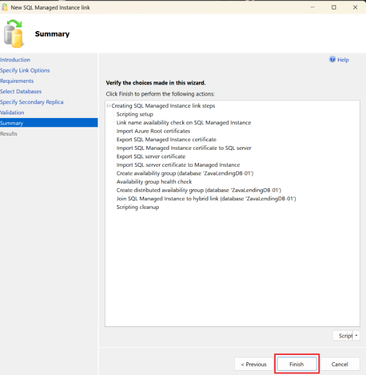

24. On **Results**, confirm that all steps have completed successfully, and then close the wizard.

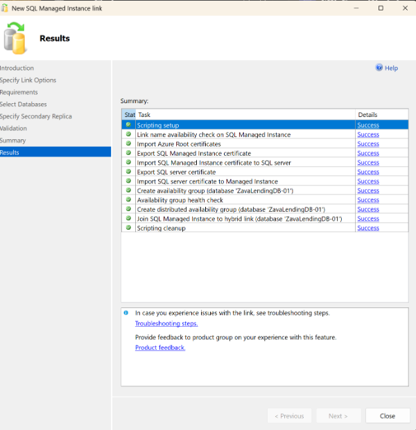

> [!NOTE]
> - Initial database seeding can take several minutes, during which the linked database is in the Restoring state on Managed Instance

On SQL Server, in** SSMS Object Explorer **expand ***Always On High Availability > Availability Groups***.

- You will see **two items **created for your database in the Obect Explorer:
  1. Always On availability group to which your database has been placed. and
  2. Distributed availability group used to link with Azure SQL Managed Instance.

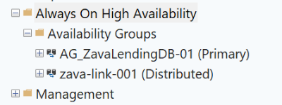

For more information on using SSMS for MI link, see [Configure a Managed Instance link with SSMS](https://learn.microsoft.com/azure/azure-sql/managed-instance/managed-instance-link-configure-how-to-ssms).

## 4. Write Data on SQL Server

Open a new query connected to the workshop **SQL Server**, replace `No`, and run the following script. It creates a validation table and records the properties of the server where the row was written.

```sql
-- Replace with your assigned database name
USE [ZavaLendingDB-No];
GO

DROP TABLE IF EXISTS dbo.MigrationValidation;
GO

CREATE TABLE dbo.MigrationValidation
(
	ValidationId int IDENTITY(1, 1) NOT NULL
	CONSTRAINT PK_MigrationValidation PRIMARY KEY,
	ValidationStep nvarchar(100) NOT NULL,
	ServerName nvarchar(128) NOT NULL,
	MachineName nvarchar(128) NULL,
	Edition nvarchar(128) NULL,
	ProductVersion nvarchar(32) NULL,
	EngineEdition int NULL,
	RecordedAtUtc datetime2(0) NOT NULL
	CONSTRAINT DF_MigrationValidation_RecordedAtUtc DEFAULT SYSUTCDATETIME()
);
GO

INSERT dbo.MigrationValidation
(
	ValidationStep,
	ServerName,
	MachineName,
	Edition,
	ProductVersion,
	EngineEdition
)
SELECT
	N'Written on SQL Server before failover',
	CONVERT(nvarchar(128), SERVERPROPERTY('ServerName')),
	CONVERT(nvarchar(128), SERVERPROPERTY('MachineName')),
	CONVERT(nvarchar(128), SERVERPROPERTY('Edition')),
	CONVERT(nvarchar(32), SERVERPROPERTY('ProductVersion')),
	CONVERT(int, SERVERPROPERTY('EngineEdition'));
GO

SELECT *
FROM dbo.MigrationValidation
ORDER BY ValidationId;

SELECT
	DB_NAME() AS DatabaseName,
	DATABASEPROPERTYEX(DB_NAME(), 'Updateability') AS Updateability;
GO
```

The final query should return `READ_WRITE`, confirming that SQL Server is the current primary and accepts writes.

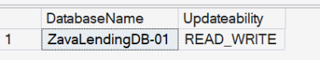

## 5. Read the Replicated Data on Managed Instance

In SSMS, connect to **Azure SQL Managed Instance**

- For **Authentication** select **SQL Server Authentication** mode
- Type in credentials to login to Azure SQL Managed Instance provided in the workshop
- For **Encryption** select **Mandatory** and enable **Trust server certificate**
- Click **Connect**


Replace `No` with your assigned database name, and and run on Azure SQL Managed Instance:

```sql
USE [ZavaLendingDB-No];
GO

SELECT *
FROM dbo.MigrationValidation
ORDER BY ValidationId;

SELECT
	DB_NAME() AS DatabaseName,
	DATABASEPROPERTYEX(DB_NAME(), 'Updateability') AS Updateability;
GO
```

The row written on SQL Server should appear on Managed Instance after replication catches up. The updateability query should return `READ_ONLY`, because Managed Instance is currently the secondary replica.

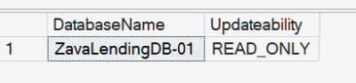

> [!IMPORTANT]
> **Checkpoint:** SQL Server returns `READ_WRITE` (confirming it is in the primary role) Managed Instance returns `READ_ONLY` (confirming it is in the secondary role) and both instances show the same validation row.

## 6. Complete the Migration to Azure

The cutover will complete migration from SQL Server to Azure SQL Managed Instance

1. In SSMS, expand Always On High Availability, and then Availability Groups
2. Locate the **Distributed** AG for your mi link (in this example`zava-link-001` - representing the name you have given for this MI link initially)
  - Right-click on the **your link name**, and select **Failover**.

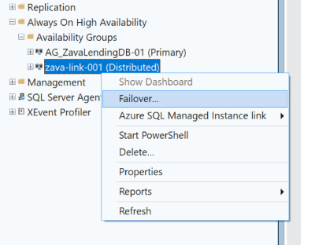

3. Select **Planned failover**, sign in to Azure, and connect to both replicas when prompted.

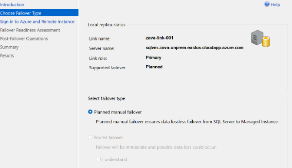

4. On Sign in to Azure and Remote Instance
  - Sign-in to Azure with your workshop account (if not already signed in)
    - Provide your **Azure portal** credentials
  - Enable check box **Use public endpoint**, and click** Sign in**.
    - Provude **credentials **to login to **Azure SQL Managed Instance**

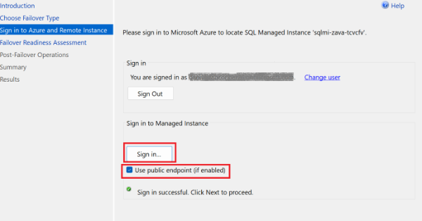

5. Ensure on the Failover Readines Assessment that all is Ready, and click **Next**

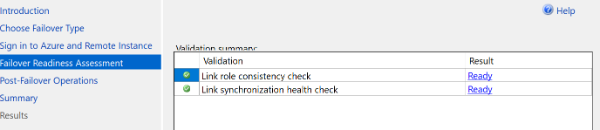

6. On **Post-Failover Operations **screen:
  1. Select check box "I understand" to confirm
  2. Select check box "Delete availability group...."

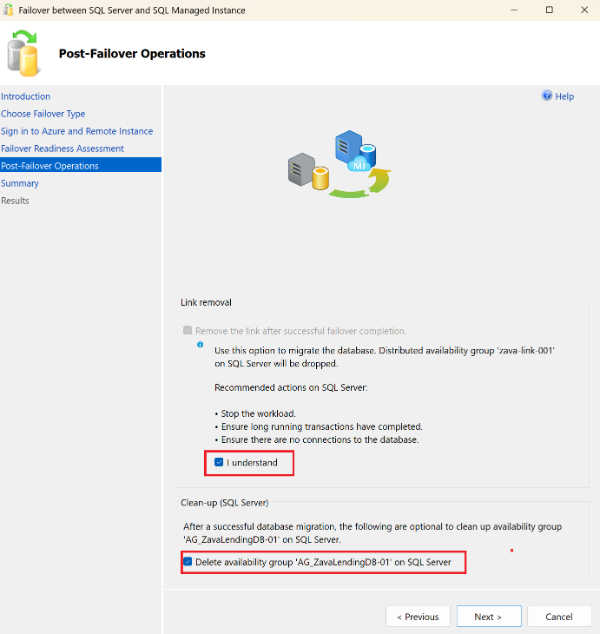

7. Select **Next**
8. Review the summary, select **Finish**, and confirm that all actions succeed.

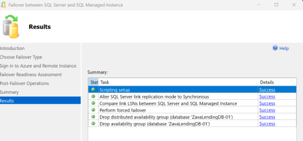

9. Connect to **Azure SQL Managed Instance**
10. Replace `No` with your assigned database number in the below script, and run it on SQL Managed Instance.

```sql
USE [ZavaLendingDB-No];
GO

SELECT
	@@SERVERNAME AS ServerName,
	DB_NAME() AS DatabaseName,
	DATABASEPROPERTYEX(DB_NAME(), 'Updateability') AS Updateability;

SELECT *
FROM dbo.MigrationValidation
ORDER BY ValidationId;
GO
```

The database on Managed Instance should report `READ_WRITE`. The database is now migrated and no longer depends on the link.

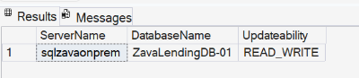

In Object Explorer, refresh **Always On High Availability** > **Availability Groups** on SQL Server and confirm that the distributed availability group for the link no longer exists.

**Checkpoint:** Managed Instance returns `READ_WRITE`, all validation rows are present, and the link has been removed.

> [!TIP]
> For production migrations:
> - In a production migration, repoint every application connection string from the SQL Server endpoint to the Azure SQL Managed Instance fully qualified domain name (FQDN), then validate application functionality, performance, monitoring, backups, and security.
> - Also migrate and validate SQL logins, SQL Server Agent jobs, credentials, linked servers, and all other required server-level objects separately, as the link migrates user databases only. Migration of system databases is not supproted to SQL PaaS service.

For the complete cutover guidance, see [Migrate to Azure SQL Managed Instance with the link](https://learn.microsoft.com/azure/azure-sql/managed-instance/managed-instance-link-migrate) and [Fail over a Managed Instance link](https://learn.microsoft.com/azure/azure-sql/managed-instance/managed-instance-link-failover-how-to).

> [!NOTE]
> The remaining sections are bonus work intended for completion at home. Create separate target databases and do not change the migrated database from Exercise 2.

# Exercise 3 (Bonus): Migrate with Log Replay Service

[Log Replay Service (LRS)](https://learn.microsoft.com/azure/azure-sql/managed-instance/log-replay-service-overview) is a free migration service based on SQL Server log-shipping technology. Continuous mode restores a full backup and then watches an Azure Blob Storage folder for new differential and transaction log backups until you initiate cutover.

Unlike Managed Instance link, a database being restored by LRS is not available for read-only queries during migration. Complete a single LRS job within 30 days.

Before starting, review [Compare Log Replay Service with Managed Instance link](https://learn.microsoft.com/azure/azure-sql/managed-instance/log-replay-service-compare-mi-link) to understand the differences in setup, online access during migration, cutover behavior, migration duration, and supported scenarios. This exercise creates `ZavaLendingDB-No` and does not modify the database migrated in Exercise 2.

> [!IMPORTANT]
> This is a bonus exercise to complete at home after the workshop. It requires your own Azure Blob Storage container, storage permissions, and enough time for the backup chain to upload and restore.

## 1. Prepare Storage and Permissions

1. Create a private Blob container and a separate flat folder for your database, for example `ZavaLendingDB-No`. Do not create nested folders inside it.
2. Grant the managed identity of the target Managed Instance the **Storage Blob Data Reader** role on the container.
3. For SQL Server `BACKUP TO URL`, generate a short-lived container SAS with only the permissions required to create the backup files. Keep the token outside source control.
4. On SQL Server, create a credential for the container. When using a SAS token, omit the leading `?` from the secret.

```sql
USE [master];
GO

CREATE CREDENTIAL [https://<storage-account>.blob.core.windows.net/<container>]
WITH IDENTITY = 'SHARED ACCESS SIGNATURE',
	 SECRET = '<sas-token-without-leading-question-mark>';
GO
```

## 2. Upload the Initial Backup Chain

Run the following on **SQL Server** after replacing `No` and the storage placeholders:

```sql
ALTER DATABASE [ZavaLendingDB-No] SET RECOVERY FULL;
GO

BACKUP DATABASE [ZavaLendingDB-No]
TO URL = 'https://<storage-account>.blob.core.windows.net/<container>/ZavaLendingDB-No/ZavaLendingDB-No-full.bak'
WITH INIT, COMPRESSION, CHECKSUM, STATS = 5;
GO

BACKUP DATABASE [ZavaLendingDB-No]
TO URL = 'https://<storage-account>.blob.core.windows.net/<container>/ZavaLendingDB-No/ZavaLendingDB-No-diff.bak'
WITH DIFFERENTIAL, COMPRESSION, CHECKSUM, STATS = 5;
GO

BACKUP LOG [ZavaLendingDB-No]
TO URL = 'https://<storage-account>.blob.core.windows.net/<container>/ZavaLendingDB-No/ZavaLendingDB-No-log-01.trn'
WITH COMPRESSION, CHECKSUM, STATS = 5;
GO
```

## 3. Start LRS in Continuous Mode

First, run this query on SQL Server and copy the source database collation:

```sql
SELECT name, collation_name
FROM sys.databases
WHERE name = N'ZavaLendingDB-No';
GO
```

Open Azure Cloud Shell in **PowerShell** mode. Replace the values, including `$sourceCollation`, and start LRS with the Managed Instance identity:

```powershell
$resourceGroupName = '<resource-group>'
$managedInstanceName = '<managed-instance-name>'
$targetDatabaseName = 'ZavaLendingDB-No-LRS'
$storageFolderUri = 'https://<storage-account>.blob.core.windows.net/<container>/ZavaLendingDB-No'
$sourceCollation = '<source-database-collation>'

$lrsJob = Start-AzSqlInstanceDatabaseLogReplay `
	-ResourceGroupName $resourceGroupName `
	-InstanceName $managedInstanceName `
	-Name $targetDatabaseName `
	-Collation $sourceCollation `
	-StorageContainerUri $storageFolderUri `
	-StorageContainerIdentity ManagedIdentity `
	-AsJob
```

The `-AsJob` switch returns control to the same Cloud Shell session while continuous restore runs. Monitor progress from that session:

```powershell
Get-AzSqlInstanceDatabaseLogReplay `
	-ResourceGroupName $resourceGroupName `
	-InstanceName $managedInstanceName `
	-Name $targetDatabaseName |
	Format-List *
```

Confirm that the command returns migration details without an error before adding more backups.

## 4. Add the Final Log Backup and Cut Over

Stop writes to the source database. Then run the final log backup on **SQL Server**:

```sql
BACKUP LOG [ZavaLendingDB-No]
TO URL = 'https://<storage-account>.blob.core.windows.net/<container>/ZavaLendingDB-No/ZavaLendingDB-No-log-final.trn'
WITH COMPRESSION, CHECKSUM, STATS = 5;
GO
```

Run `Get-AzSqlInstanceDatabaseLogReplay` again and inspect the detailed output. Do not cut over until the operation is healthy and the output confirms that `ZavaLendingDB-No-log-final.trn` is the latest restored backup. Then complete the migration in Cloud Shell:

```powershell
Complete-AzSqlInstanceDatabaseLogReplay `
	-ResourceGroupName $resourceGroupName `
	-InstanceName $managedInstanceName `
	-Name $targetDatabaseName `
	-LastBackupName 'ZavaLendingDB-No-log-final.trn'
```

After cutover, the LRS database becomes available for read/write access. Repoint the application connection string and migrate the required server-level objects separately.

Connect to `ZavaLendingDB-No-LRS` on Managed Instance and verify the completed migration:

```sql
SELECT
	@@SERVERNAME AS ServerName,
	DB_NAME() AS DatabaseName,
	DATABASEPROPERTYEX(DB_NAME(), 'Updateability') AS Updateability;
GO
```

The result should show `ZavaLendingDB-No-LRS` as `READ_WRITE`.

Learn more:

- [Migrate databases by using Log Replay Service](https://learn.microsoft.com/azure/azure-sql/managed-instance/log-replay-service-migrate)
- [Compare Log Replay Service with Managed Instance link](https://learn.microsoft.com/azure/azure-sql/managed-instance/log-replay-service-compare-mi-link)

# Exercise 4 (Bonus): Native Backup and Restore with Azure Blob Storage

This example creates `ZavaLendingDB-No-NativeRestore`. It does not replace or modify the migrated `ZavaLendingDB-No` database from Exercise 2.

Azure SQL Managed Instance supports native SQL Server backup and restore syntax with Azure Blob Storage. This example takes a copy-only backup from Managed Instance and restores it as a separate database. A copy-only backup does not disrupt the managed service's automated backup chain.

## Prerequisites

1. Create or identify a private Azure Blob Storage container.
2. Grant the managed identity of the Azure SQL Managed Instance the **Storage Blob Data Contributor** role on the storage account or container.
3. Replace all placeholder values in the following script. Use a unique backup file name containing your attendee number.

Connect to the `master` database on **Azure SQL Managed Instance** and run:

```sql
USE [master];
GO

CREATE CREDENTIAL [https://<storage-account>.blob.core.windows.net/<container>]
WITH IDENTITY = 'MANAGED IDENTITY';
GO

BACKUP DATABASE [ZavaLendingDB-No]
TO URL = 'https://<storage-account>.blob.core.windows.net/<container>/ZavaLendingDB-No-copyonly.bak'
WITH COPY_ONLY, COMPRESSION, CHECKSUM, STATS = 5;
GO

RESTORE HEADERONLY
FROM URL = 'https://<storage-account>.blob.core.windows.net/<container>/ZavaLendingDB-No-copyonly.bak';
GO

RESTORE DATABASE [ZavaLendingDB-No-NativeRestore]
FROM URL = 'https://<storage-account>.blob.core.windows.net/<container>/ZavaLendingDB-No-copyonly.bak'
WITH STATS = 5;
GO

SELECT name, state_desc
FROM sys.databases
WHERE name IN (N'ZavaLendingDB-No', N'ZavaLendingDB-No-NativeRestore');
GO

```

If the credential already exists, do not create a duplicate. Confirm that the credential URL exactly matches the container URL and never place credentials or SAS tokens in source control.

Learn more:

- [Restore a database to Azure SQL Managed Instance](https://learn.microsoft.com/azure/azure-sql/managed-instance/restore-sample-database-quickstart)
- [SQL Server backup to URL for Azure Blob Storage](https://learn.microsoft.com/sql/relational-databases/backup-restore/sql-server-backup-to-url)
- [Restore a database to SQL Server from Azure SQL Managed Instance](https://learn.microsoft.com/azure/azure-sql/managed-instance/restore-database-to-sql-server)

# Learn More

- [Migrate SQL Server to Azure SQL with SSMS](https://learn.microsoft.com/ssms/migrate/migrate-sql-server-azure-sql)
- [Install SQL Server Management Studio](https://learn.microsoft.com/ssms/install/install)
- [Assess migration readiness with SQL Server enabled by Azure Arc](https://learn.microsoft.com/sql/sql-server/azure-arc/migration-assessment)
- [Overview of the Managed Instance link](https://learn.microsoft.com/azure/azure-sql/managed-instance/managed-instance-link-feature-overview)
- [Prepare your environment for the link](https://learn.microsoft.com/azure/azure-sql/managed-instance/managed-instance-link-preparation)
- [Configure the link with SSMS](https://learn.microsoft.com/azure/azure-sql/managed-instance/managed-instance-link-configure-how-to-ssms)
- [Fail over the link](https://learn.microsoft.com/azure/azure-sql/managed-instance/managed-instance-link-failover-how-to)
- [Migrate with the link](https://learn.microsoft.com/azure/azure-sql/managed-instance/managed-instance-link-migrate)
- [Update policy in Azure SQL Managed Instance](https://learn.microsoft.com/azure/azure-sql/managed-instance/update-policy)

# What's next

Congratulations! 🎉

You configured a Managed Instance link, validated near-real-time replication and bidirectional planned failover, and completed a minimum-downtime database migration to Azure SQL Managed Instance. If you completed the optional sections, you also assessed Azure migration readiness and practiced an LRS-based migration using a backup chain in Azure Blob Storage.

Next, continue to [Module 3 - Modernize in Azure](../Module%203%20-%20Modernize%20in%20Azure/README.md).
