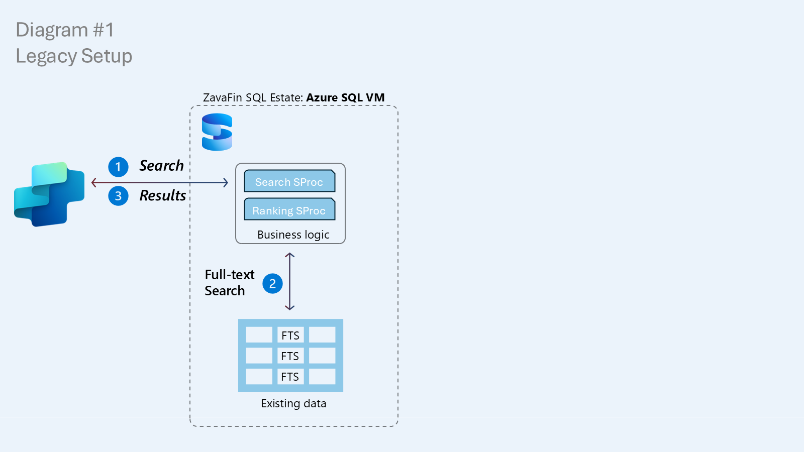
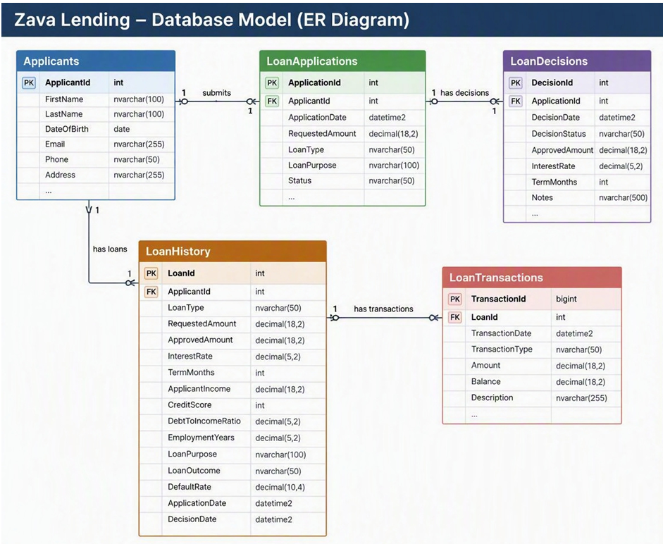
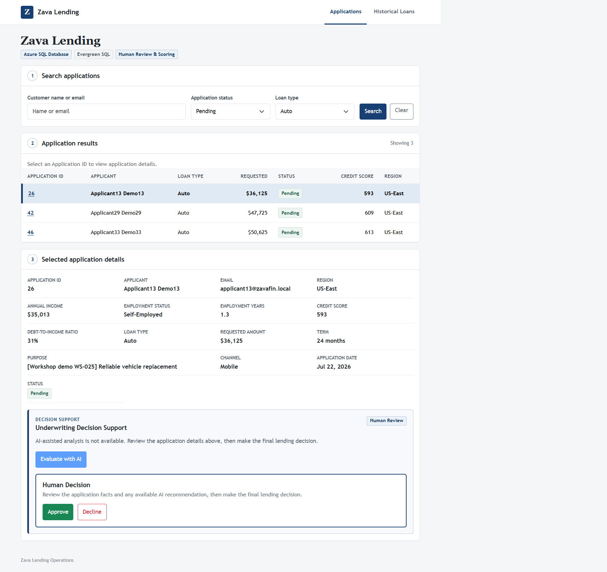

# Exercise 3.0 - About ZavaFin

ZavaFin is a fictional lending company. Loan officers review new applications and compare them with historical outcomes before making an underwriting decision. The operational database contains structured facts such as credit score, amount, and loan type, together with unstructured loan narratives.

This exercise establishes the business problem and the application baseline. You will not change the database yet.

## Prerequisites

- Complete **Shared prerequisites** in the [Module 3 setup guide](../README.md).
- Follow **(optional) Start the legacy Zava Lending application** in the [Module 3 setup guide](../README.md).
- Connect SSMS to your assigned `ZavaLendingDB-No`.

## The starting point

ZavaFin already has valuable data, stored procedures, security boundaries, and a working application. Its loan officers can browse current applications and search historical loans. The limitations are in the database capabilities behind those screens:

1. **Search is based on words, not meaning.** Full-text search can find expected vocabulary, but *"utterly tapped out and drowning in red ink"* does not match narratives that describe the same financial distress using different words.
2. **Scoring is entirely manual.** A loan officer must inspect application facts and reason about comparable historical loans without decision support.

The goal is not to replace the application. The goal is to make the existing application more intelligent by modernizing its SQL implementation.

## Legacy architecture

*The application calls stable SQL stored procedure contracts over existing relational data. Search depends on full-text search and fixed ranking logic.*

The application already separates user experience from data logic. That separation gives us a low-risk modernization seam: keep the same stored procedure names and result shapes, but improve how SQL produces the results.

## Database model

*The lending data model used by the SQL scripts and application.*

The module works primarily with these objects:

| Object                         | Purpose                                                                     |
| ------------------------------ | --------------------------------------------------------------------------- |
| `dbo.Applicants`               | Applicant identity and financial facts                                      |
| `dbo.LoanApplications`         | Current applications awaiting review                                        |
| `dbo.LoanHistory`              | Historical loans, outcomes, and narrative text                              |
| `dbo.LoanNarrativeEmbeddings`  | Vector representation of each historical narrative; created in Exercise 3.2 |
| `dbo.usp_LoanSearch`           | Existing search contract called by the application                          |
| `dbo.usp_ScoreLoanApplication` | Advisory scoring contract detected and called by the application            |

## What ZavaFin wants

ZavaFin wants loan officers to:

- describe a borrower situation in ordinary language;
- find historical loans with similar meaning even when the wording differs;
- combine similarity with business criteria such as loan type, outcome, credit score, amount, and date; and
- receive an AI-assisted risk assessment grounded in comparable historical loans.

ZavaFin also requires responsible use of AI. Fairness, reliability, safety, privacy, security, inclusiveness, transparency, and accountability all matter. The model will recommend; a human loan officer will remain responsible for the final lending decision.

## Application checkpoint: experience the baseline

*Application 26 in the baseline state: the application details are available, but AI analysis is unavailable and **Evaluate with AI** is disabled.*

1. In the app, select **Applications**.
2. To reproduce the example above, filter for **Pending** and **Auto**, then select application `26`.
3. Locate **Underwriting Decision Support**.
4. Observe the **Human Review** badge, the short message that no AI analysis is available, and the disabled **Evaluate with AI** button.
5. Select **Historical Loans**.
6. Enter `utterly tapped out and drowning in red ink`, choose **Small business**, and select **Search**.
7. Record what the app can and cannot do.

Notice that Underwriting Decision Support does not repeat the application details above it and does not offer a recommendation or historical evidence. The loan officer receives no additional help in this state.

The important observation is architectural: modernizing the app without changing the code means you will use these same screens after modernization. No new application build will be introduced between checkpoints.

> [!NOTE]
> If your database already contains objects from an earlier run, the badges may not show the baseline state. Script `07` in Exercise 3.4 restores the Human Review baseline. Ask an instructor before using [00-reset.sql](../scripts/00-reset.sql).

## Exercise summary

You established that:

- ZavaFin's operational data and application already provide a strong foundation;
- full-text search cannot reliably match meaning expressed with different words;
- manual underwriting lacks comparable-loan decision support; and
- stable stored procedure contracts let us modernize the app without changing the code.

When you are ready, continue to [Exercise 3.1 - SQL Managed Instance Benefits](<../01 - SQL Managed Instance Benefits/README.md>).
