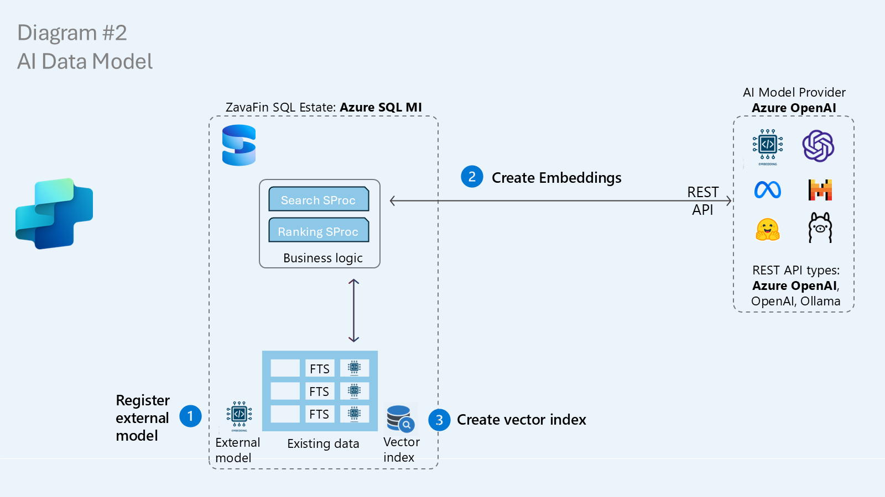
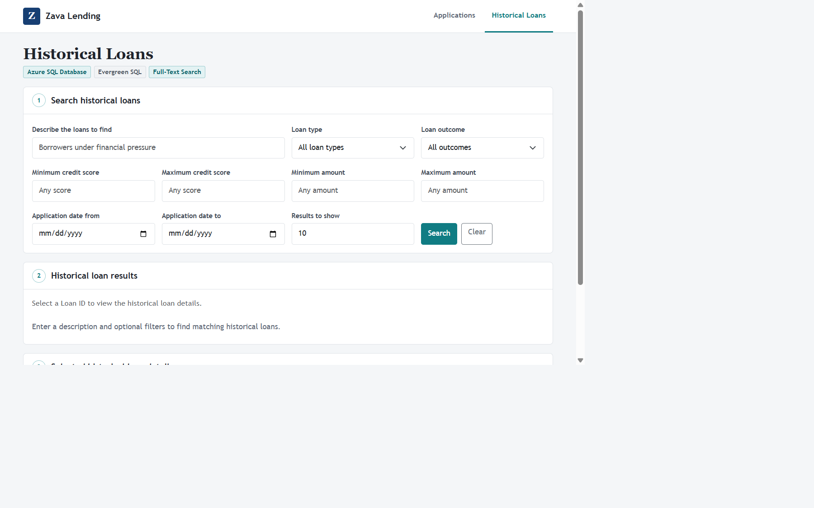

# Exercise 3.2 - AI Foundations

The first modernization step teaches SQL how to represent meaning. Text is sent to an embedding model, which returns an ordered vector of numbers. Semantically similar text produces vectors that are close to one another. SQL stores those vectors beside the operational data and indexes them for fast similarity search.

Keep the application running throughout this exercise. You are preparing a new data capability behind its existing search contract, beginning to modernize the app without changing the code.

## Prerequisites

- Complete [Exercise 3.1 - SQL Managed Instance Benefits](<../01 - SQL Managed Instance Benefits/README.md>).
- Keep the Zava Lending application running.
- Connect SSMS to your assigned `ZavaLendingDB-No`.
- The database-scoped credential required by the external model is already pre-created in each workshop database; do not recreate or modify it.

## Architecture



*SQL registers an external model, calls its REST endpoint to create embeddings, stores the vectors, and builds a vector index.*

The model runs outside the SQL engine and cannot browse the database. SQL controls what text is sent to the endpoint. A named external model gives T-SQL a governed interface to that endpoint while the vectors and relational data remain together in SQL.

## Just enough AI concepts

- An **embedding** converts semantic meaning into numbers. Similar concepts end up close together mathematically.
- A **vector** is the ordered array of numbers returned by the embedding model.
- A **vector distance** measures how close two embeddings are. This workshop uses cosine distance; a smaller distance means a closer semantic match.
- A **REST endpoint** is the HTTP interface exposed by the model provider.
- An **external model** gives T-SQL a named reference to a supported model endpoint.
- `AI_GENERATE_EMBEDDINGS` sends text to that model and returns a SQL `VECTOR`.
- A **DiskANN vector index** organizes high-dimensional vectors as a graph so SQL can find nearby vectors without comparing every row.

Model choice matters. Semantic distance depends on the model that generated both vectors, so use the same embedding model for stored narratives and incoming search prompts.

## Step 1: Register the external embedding model

Open [01-register-external-model.sql](<./scripts/01-register-external-model.sql>), confirm that the SSMS database selector shows your assigned database, and run the entire script.

The script:

1. verifies that the workshop database-scoped credential exists;
2. registers `FoundryEmbeddingModel` for `text-embedding-3-large`; and
3. calls `AI_GENERATE_EMBEDDINGS` with a short test prompt.

**Expected result:** SSMS prints `External model registered.` and returns one vector value for `This is a test`.

> [!TIP]
> If you receive `Required database-scoped credential does not exist`, stop. Confirm that you are connected to your assigned database and ask the instructor to provision the workshop credential. Do not put an API key into a SQL file.

## Step 2: Generate narrative embeddings

Open and run [02-add-narratives-and-embeddings.sql](<./scripts/02-add-narratives-and-embeddings.sql>).

The script:

1. creates `dbo.LoanNarrativeEmbeddings`;
2. links it to `dbo.LoanHistory` by `LoanId`; and
3. generates a 3,072-dimension `float16` embedding for each of the first 100 narratives.

The work is intentionally split into batches of five rows. Each batch invokes the model endpoint and can take time. Let the script finish and do not run it a second time while it is processing.

Validate the result:

```sql
SELECT
    COUNT(*) AS EmbeddingCount,
    MIN(DATALENGTH(NarrativeEmbedding)) AS MinimumBytes,
    MAX(DATALENGTH(NarrativeEmbedding)) AS MaximumBytes
FROM dbo.LoanNarrativeEmbeddings;
```

Expected values are `100`, `6144`, and `6144`: 3,072 dimensions multiplied by 2 bytes for `float16`.

## Step 3: Add the DiskANN vector index

Open and run [03-add-vector-index.sql](<./scripts/03-add-vector-index.sql>).

The script:

1. counts the available embeddings;
2. creates `IX_LoanNarrativeEmbeddings_Vector` when at least 100 rows are present; and
3. proves semantic matching with the same *"utterly tapped out and drowning in red ink"* prompt that full-text search could not understand.

**Expected result:** SSMS prints `DiskANN vector index created.` and returns semantically related loans even though the prompt's exact words do not appear in their narratives.

## Step 4: Maintain vectors during normal DML

Open and run [04-dml-insert-search.sql](<./scripts/04-dml-insert-search.sql>) **once**.

The script inserts three new historical loans and generates an embedding for each new narrative. SQL maintains the vector index as rows are inserted; you do not drop or rebuild it.

**Expected result:** three rows are returned with a generated timestamp and an embedding size of 6,144 bytes.

> [!IMPORTANT]
> Script `04` inserts three new rows every time it runs. Run it once during the normal workshop flow. If you accidentally run it more than once, ask the instructor before using [00-reset.sql](<../scripts/00-reset.sql>).

## Application checkpoint: ready behind the scenes



*The vectors and DiskANN index now exist behind the scenes. With no application code changes, the app continues to show **Full-Text Search** through the original stored procedure implementation.*

Refresh **Historical Loans**. The vector data and index now exist, but the application still calls the same `dbo.usp_LoanSearch` procedure and therefore still presents the current search behavior.

This checkpoint demonstrates an important modernization principle:

> Infrastructure and data capabilities can be introduced behind a stable application contract before user-visible behavior changes.

No application files, routes, controllers, repositories, or deployment artifacts changed in this exercise.

## Exercise summary

You:

- registered a governed model endpoint inside the database;
- converted narrative meaning into native SQL vectors;
- created a DiskANN approximate nearest-neighbor index;
- inserted new data and maintained the vector index through normal DML; and
- prepared the app for semantic search without changing the code.

When you are ready, continue to [Exercise 3.3 - Natural Language Search](<../03 - Natural Language Search/README.md>).
