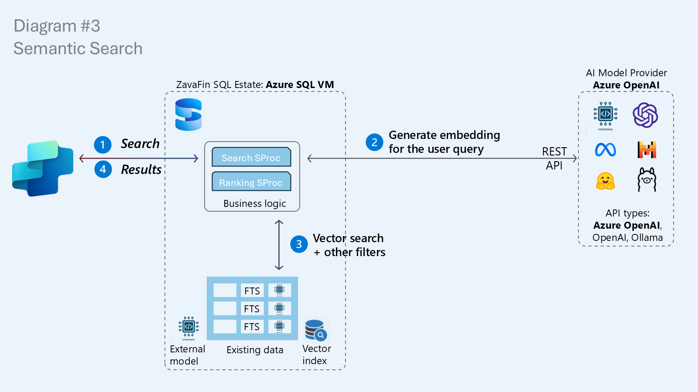
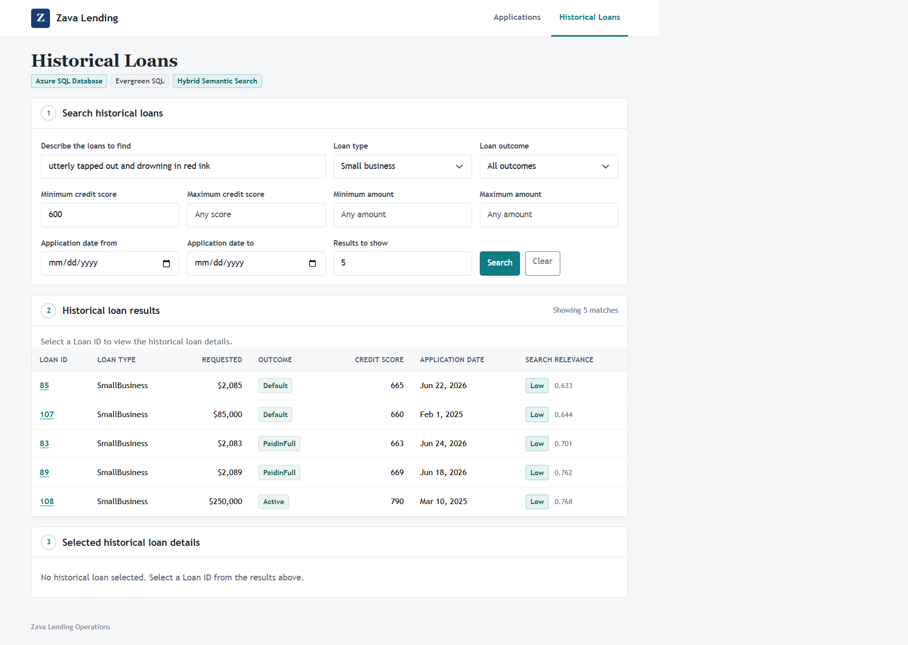

# Exercise 3.3 - Natural Language Search

Semantic similarity is most useful when it works with normal business predicates. A loan officer should be able to describe a situation in natural language and still filter by loan type, outcome, credit score, amount, or date.

In this exercise, you will upgrade the implementation of `dbo.usp_LoanSearch`. The Zava Lending application already calls this procedure, so you can modernize the app with natural-language search without changing the code.

## Prerequisites

- Complete [Exercise 3.2 - AI Foundations](<../02 - AI Foundations/README.md>).
- Keep the same Zava Lending process running.
- Connect SSMS to your assigned `ZavaLendingDB-No`.
- Confirm that `FoundryEmbeddingModel`, `dbo.LoanNarrativeEmbeddings`, and the vector index exist.

## Architecture



*SQL embeds the user's prompt, searches the vector index, applies relational filters, and returns ranked results through the existing search procedure.*

## How hybrid search works

Similarity is about closeness rather than exact words. SQL embeds the incoming prompt using the same model used for the loan narratives, then uses cosine distance to find nearby vectors.

Vector similarity alone is not enough for lending. The query also needs exact filters:

```text
natural-language prompt
        |
        v
AI_GENERATE_EMBEDDINGS
        |
        v
VECTOR_SEARCH + WHERE filters + TOP (N) WITH APPROXIMATE
        |
        v
ranked, filtered loans
```

`TOP (N) WITH APPROXIMATE` allows SQL to continue traversing the DiskANN graph while applying relational predicates. This iterative filtering avoids selecting the nearest vectors first and then discarding most of them after the search.

## Step 5: Upgrade the existing search procedure

Open and run [05-hybrid-search-procedure.sql](<./scripts/05-hybrid-search-procedure.sql>).

Watch the results in two phases:

1. The script creates the legacy full-text implementation of `dbo.usp_LoanSearch`.
  - A prompt containing expected words can return results.
  - `utterly tapped out and drowning in red ink` cannot reliably find the relevant narratives.
2. The script alters the **same procedure contract** to use:
  - `AI_GENERATE_EMBEDDINGS`;
  - `VECTOR_SEARCH`;
  - relational `WHERE` predicates; and
  - `TOP (@TopN) WITH APPROXIMATE`.

**Expected result:** the final query returns Small Business loans related to financial distress even though the prompt uses different vocabulary.

The application still calls:

```text
dbo.usp_LoanSearch
```

The parameters and relational result shape remain compatible. Only the implementation behind that contract changed.

## Step 6: Explore search behavior

Open and run [06-explore-search.sql](<./scripts/06-explore-search.sql>).

Review the two representative tests:

| Test | What it demonstrates                                  |
| ---- | ----------------------------------------------------- |
| 1    | Semantic ranking without relational filters           |
| 2    | Semantic ranking constrained by type, amount, and date |

Do not compare distance values across different embedding models. Use the ranking within one result set and validate that the returned narratives make business sense.

## Application checkpoint: natural-language search



*The same screen now understands a paraphrased description, applies the structured filters, and returns five ranked historical loans through the new procedure implementation, with no application code changes.*

1. Wait up to 30 seconds, refresh the app, and select **Historical Loans**.
2. Confirm that the capability badge now shows **Hybrid Semantic Search**.
3. Enter:
  ```text
   utterly tapped out and drowning in red ink
  ```
4. Choose **Small business**, set **Minimum credit score** to `600`, and set **Results to show** to `5`.
5. Select **Search**.
6. Confirm that the narratives match the meaning of the prompt and every row satisfies the filters.

If time permits, try your own prompt or select a Loan ID to inspect its full narrative.

Compare this screen with the baseline from Exercise 3.0. The form, route, and application repository use the same code. The visible improvement comes entirely from replacing the full-text implementation of `dbo.usp_LoanSearch` with a hybrid implementation.

## Exercise summary

You:

- converted a natural-language prompt into an embedding;
- combined approximate vector search with normal SQL predicates;
- used iterative filtering to return the requested number of qualified matches;
- demonstrated semantic matching when exact words are absent; and
- modernized the existing Historical Loans screen without changing the code.

When you are ready, continue to [Exercise 3.4 - AI-Assisted Loan Scoring](<../04 - AI-Assisted Loan Scoring/README.md>).
