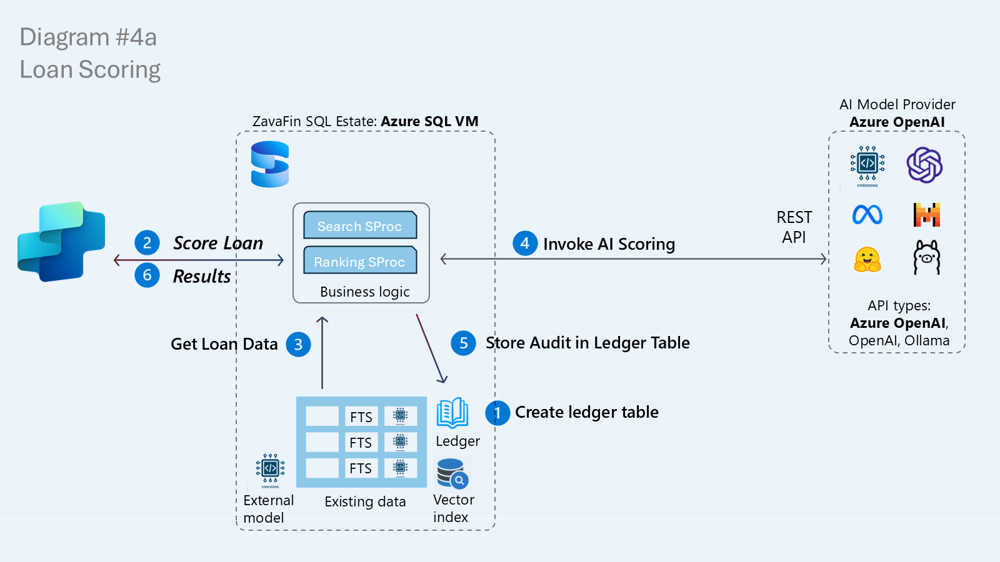
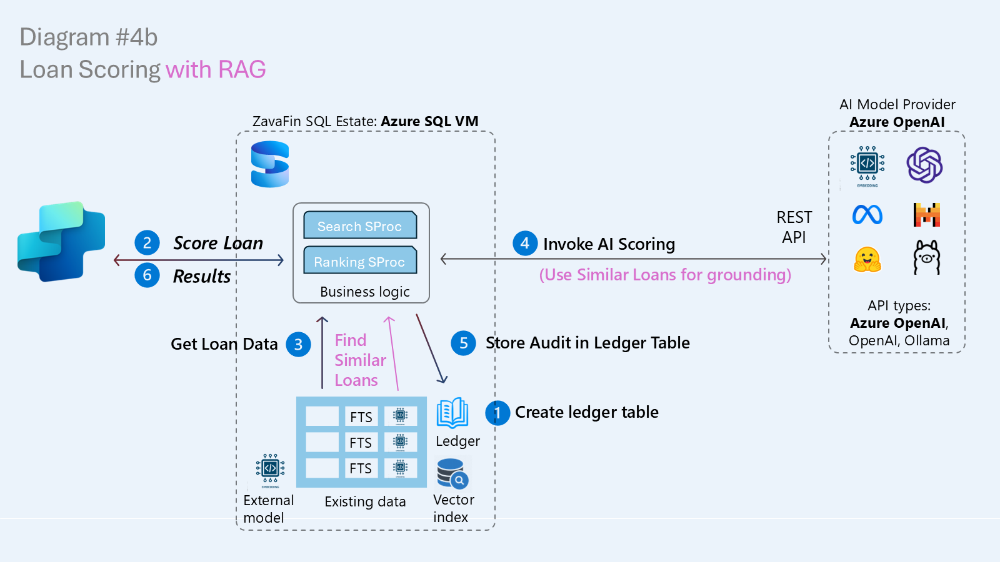
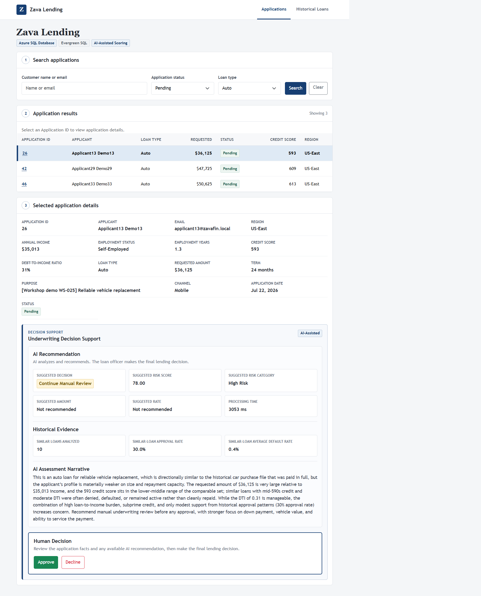

# Exercise 3.4 - AI-Assisted Loan Scoring

Hybrid search helps loan officers find evidence. This exercise uses that evidence to generate an advisory risk assessment. The existing **Applications** screen detects whether `dbo.usp_ScoreLoanApplication` is available and calls it when the loan officer selects **Evaluate with AI**.

You will move from Human Review to AI-Assisted decision support by deploying one stored procedure, continuing to modernize the app without changing the code.

## Prerequisites

- Complete [Exercise 3.3 - Natural Language Search](<../03 - Natural Language Search/README.md>).
- Keep the same Zava Lending process running.
- Connect SSMS to your assigned `ZavaLendingDB-No`.
- Confirm that the instructor has provisioned the workshop scoring endpoint and database-scoped credential.

## From an AI call to grounded decision support

*The conceptual scoring architecture retrieves lending data, invokes an AI model, and returns a result.*

An AI model has broad knowledge from training, but it does not know ZavaFin's current applications or historical outcomes. Grounding is not about adding more instructions. It is about giving the model relevant, current business evidence instead of asking it to rely on imagination.

*Similar historical loans ground the assessment so the model reasons over ZavaFin evidence rather than only its training data.*

The implementation follows a retrieval-augmented generation (RAG) pattern:

1. retrieve the current application and applicant facts;
2. embed a concise description of that application;
3. find the ten most similar historical loans;
4. calculate approval and default evidence in SQL;
5. send the application and grounded evidence to the scoring model through `sp_invoke_external_rest_endpoint`; and
6. return a normalized relational result for a human underwriter.

> [!NOTE]
> The diagrams show a broader target architecture, including a ledger-based audit path. Script `08` deliberately implements an **advisory, side-effect-free** assessment. It does not insert a decision, update application status, or write an audit ledger. Script `09` verifies those boundaries.

## Responsible AI boundary

The model analyzes and recommends; the loan officer makes the final lending decision. The procedure:

- limits the model to a clear JSON response contract;
- validates and normalizes the returned decision, risk category, score, and narrative;
- calculates amount and rate recommendations deterministically in SQL;
- returns the historical evidence used for grounding;
- throws an explicit error if the endpoint or response is invalid; and
- does not persist or enact a lending decision.

This supports transparency and accountability: the user can see both the recommendation and the evidence, and the application does not silently turn a model response into a lending outcome.

## Step 7: Establish the Human Review baseline

Open and run [07-human-review.sql](<./scripts/07-human-review.sql>).

The script removes `dbo.usp_ScoreLoanApplication`, making the application's starting behavior explicit.

**Expected result:** `ScoringProcedureObjectId` is `NULL` and `ApplicationMode` is `Human Review & Scoring`.

### Application checkpoint: Human Review

*Before the scoring procedure exists, the selected application remains a human-only review: no recommendation, no historical evidence, and no enabled AI action.*

1. Wait up to 30 seconds and refresh **Applications**.
2. Filter for **Pending** and **Auto**, then select application `26`.
3. Confirm that **Underwriting Decision Support** shows **Human Review**.
4. Confirm that the section does not repeat the selected application details or provide a recommendation or historical evidence.
5. Confirm that **Evaluate with AI** is disabled.

The compact section makes the baseline explicit: the loan officer has the application details above, but receives no additional help until AI comes to the rescue.

## Step 8: Deploy AI-assisted scoring

Open and run [08-ai-assisted-loan-scoring.sql](<./scripts/08-ai-assisted-loan-scoring.sql>).

The script creates `dbo.usp_ScoreLoanApplication` with one public input, `@ApplicationId`, and one relational result row. Follow the one-line comments through application retrieval, vector search, evidence aggregation, the Foundry call, response validation, and deterministic recommendations.

**Expected result:** SSMS prints `AI-assisted dbo.usp_ScoreLoanApplication created`.

> [!TIP]
> If scoring later reports that it could not be completed, first confirm that you are in your assigned database and that the workshop scoring credential exists. Never add an endpoint key to this repository.

### Application checkpoint: AI-Assisted

*The same application screen now provides an advisory risk assessment grounded in ten similar historical loans, while the approve-or-decline decision remains with the loan officer.*

1. Wait up to 30 seconds and refresh the same **Applications** page.
2. Keep the **Pending** and **Auto** filters, then select application `26`.
3. Confirm that the badge now shows **AI-Assisted**.
4. Select **Evaluate with AI** and wait for the assessment.
5. Review:
  - suggested decision;
  - risk score and category;
  - suggested amount and rate;
  - similar loans analyzed;
  - similar-loan approval and default rates;
  - processing time; and
  - the AI assessment narrative.
6. Compare the recommendation with the raw applicant facts. Treat the output as decision support, not an automatic decision.

This is the strongest before-and-after checkpoint in the module. The running application has not been rebuilt or redeployed. It discovers the new stored procedure and enables an experience that was already designed into the stable UI contract.

## Step 9: Run a scoring and safety check

Open and run [09-explore-ai-assisted-scoring.sql](<./scripts/09-explore-ai-assisted-scoring.sql>).

The script performs two focused checks:

1. score application `1` and review its advisory assessment and grounded evidence;
2. inspect the procedure for the governed model call and confirm that it contains no decision, ledger, or application writes.

**Expected result:** the assessment returns one row, `ScoringMode` is `AI-Assisted Scoring`, and `SafetyBoundary` is `Advisory only: no persistence statements detected`.

> [!IMPORTANT]
> The generated wording can vary. Treat the result as advice: the loan officer still owns the final decision.

## Exercise summary

You:

- grounded an AI assessment in current application data and similar historical loans;
- invoked a model directly from SQL through a governed REST endpoint;
- returned model output through a stable relational contract;
- preserved human control and side-effect-free evaluation;
- audited the procedure's no-write boundary; and
- enabled AI-Assisted decision support without changing or redeploying the application.

When you are ready, continue to [Exercise 3.5 - Summary](<../05 - Summary/README.md>).
