# Grow in Azure

This hands-on module will teach you how to use Azure SQL Database Hyperscale features to recover large databases quickly, and scale read-only workloads to named replicas. You will also use GitHub Copilot in SQL Server Management Studio (SSMS) to investigate and manage a Hyperscale database. The optional advanced exercises use GitHub Copilot in Visual Studio Code for Azure management-plane tasks.

## Exercises

The following exercises are available in this module:

- Exercise 1: Recover a Hyperscale database with point-in-time restore
  - Simulate an accidental data deletion, restore the database to an earlier point in time, and verify that the deleted data is recovered without replacing the source database.
- Exercise 2: Offload read workloads to a Hyperscale named replica
  - Create a standalone named replica, verify its relationship to the primary database, and test read-only workload routing.
- Exercise 3: Use GitHub Copilot in SSMS to Manage Azure SQL Database Hyperscale
  - Use GitHub Copilot in SSMS to generate and review read-only T-SQL for replica topology, resource utilization, replica lag, backup retention, and Query Store analysis.
- Exercise 4: Advanced (Optional): Manage Azure SQL Database Hyperscale with GitHub Copilot in VS Code
  - Use GitHub Copilot in Visual Studio Code with Azure tools to inventory resources, audit backup policies, investigate activity logs, plan a named replica, and draft an administrator runbook.

By the end of this module, you will be able to:

- Explain how Hyperscale point-in-time restore works and use it to recover deleted data without replacing the source database.
- Explain when to use a Hyperscale named replica, create one, and validate read-only workload offload.
- Use GitHub Copilot in SSMS to investigate Hyperscale architecture, resource utilization, replica lag, backup retention, and query performance.
- Optionally use GitHub Copilot in Visual Studio Code to inspect Azure SQL resources, audit configuration, investigate operations, and prepare deployment plans and runbooks.

> [!IMPORTANT]
> Restores and named replicas create new billable databases. Use the names in this module so that you can identify and delete the workshop resources during cleanup.

# Exercise 1: Recover a Hyperscale database with point-in-time restore

Point-in-time restore creates a **new database** containing the source database as it existed at a selected time within its short-term retention period. It does not overwrite the source database.

Hyperscale backups differ from traditional SQL Server backups:

- Hyperscale takes regular storage snapshots of its data files instead of traditional full and differential backups.
- Transaction log records are retained and applied to the selected snapshot during recovery.
- Snapshot backup is **virtually instantaneous** and **doesn't consume compute resources** on the primary or secondary replicas.
- A **same-region** **restore normally completes in minutes** rather than hours or days, even for a **multi-terabyte database**, because it isn't a size-of-data operation.

Restore time is not guaranteed. Transaction log replay, regional load, concurrent restores, and changing storage or zone redundancy can increase the duration. A cross-region geo-restore is a size-of-data operation and is outside the scope of this exercise.

## 1. Connect to Azure SQL logical server

For this exercise you will first need to connect to the Hyperscale server provided by your instructor. You will need to connect via SSMS to the hyperscale server. Optionally, we would also like to show you how you can connect via built-in Query Editor in Azure portal.

Each customer has an assigned database named `ZavaLendingDB-No`. Replace `No` with your assigned workshop database number. For example, customer 07 must connect to `ZavaLendingDB-07`.

> [!IMPORTANT]
> - You must connect directly to your **assigned** `ZavaLendingDB-No` **database**.
> - Do not connect to **another attendee's database**.

### Locate Azure SQL logical server in Azure portal

1. Open the [Azure portal](https://portal.azure.com) and sign in with the workshop account provided by the instructor.
2. Open the portal menu, and then select **Dashboard**.
3. Open the dashboard selector, and then select **Tutorial E, SQL Con Barcelona**.
  - If **Tutorial E, SQL Con Barcelona** does not appear in the dashboard selector, select **Browse all dashboards** and open it from the shared dashboards list. Refresh the portal if the dashboard or its pinned resources do not appear immediately.
4. On the shared workshop dashboard, locate the pinned **SQL server** resource for the Hyperscale databases, and then select it.

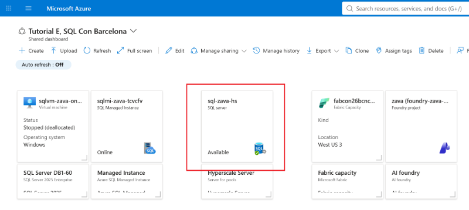

1. On the SQL logical server **Overview** page, copy the fully qualified **Server name**, such as `<server-name>.database.windows.net`, and record it in **Before you begin**. You will use this name to connect from SSMS.

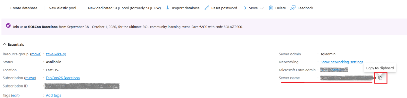

### Connect via SSMS (default)

1. Open SSMS and connect to the workshop logical server by using the credentials provided by the instructor.
2. In the **Connect to Server** dialog, configure the connection:
  - For **Server Name**, enter the logical server name recorded previously. If only the short server name was provided, enter `<server-name>.database.windows.net`.
  - For **Authentication**, select `SQL Server Authentication` method.
  - For **User Name** and **Password**, enter provided credentials in the workshop.
  - For **Connect to database**, enter your **exact assigned database name**, such as `ZavaLendingDB-07`. Do not leave this setting as `<default>`.
  - For **Encrypt**, select `Mandatory`, and enable the check box `Trust Server Certificate`.
3. Click on **Connect**.

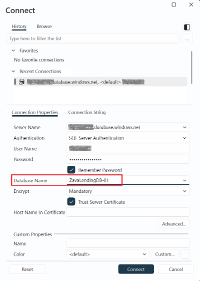

1. In **Object Explorer**, on the database drop-down menu, select your assigned `ZavaLendingDB-No` instead of the `master` database.
2. Run the following SQL query to ensure you are connected to the correct database. The results should show your assigned database name.

```sql
SELECT DB_NAME() AS CurrentDatabase;
```

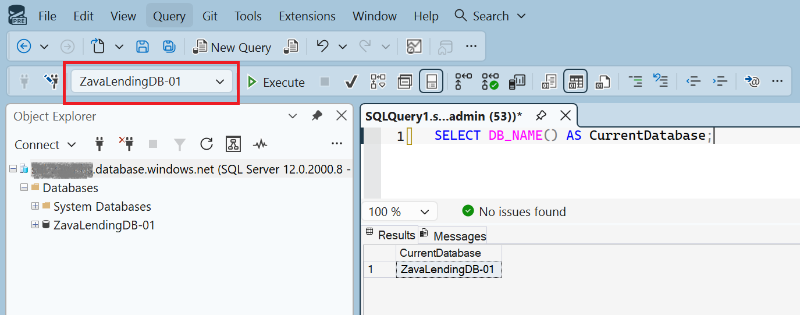

### Connect via Query Editor in Azure portal (optional)

We would also like to show you that you can connect to Azure SQL Hyperscale using the online Query Editor.

1. Open the [Azure portal](https://portal.azure.com),
2. Access the **Azure SQL logical server** (the same screen as above to find out the server nane)
3. Expand the menu **Settings**
4. Click on **SQL Databases** menu item within Settings
5. In the search field, **type in** the exact name of your assigned database, such as `ZavaLendingDB-01`. Verify the full database name before continuing; do not select another attendee's database.
6. **Click** on the **database name** to access the property page of this database

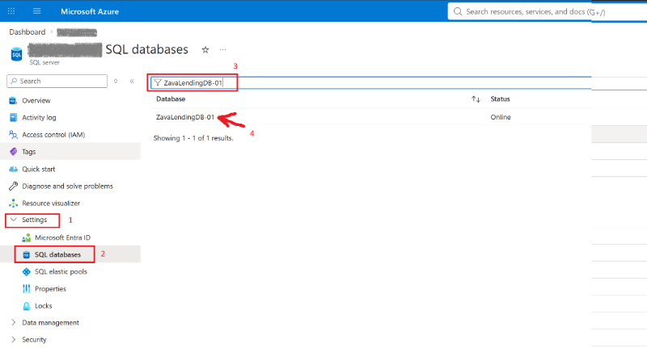

1. On the database menu, under **Query editor**, select **Query editor (preview)**.

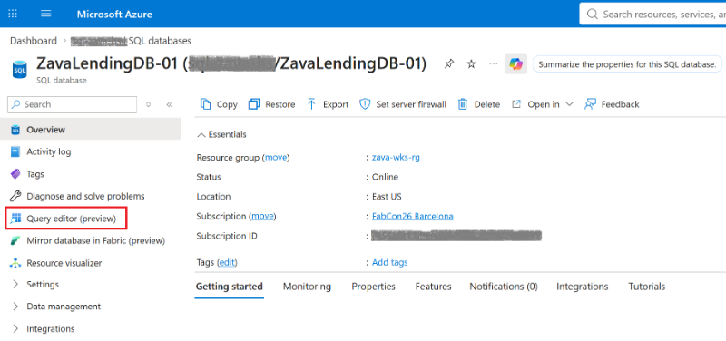

1. On the sign-in page, select the `SQL Server Authentication` authentication method specified by the instructor, and then enter or select the provided account credentials.

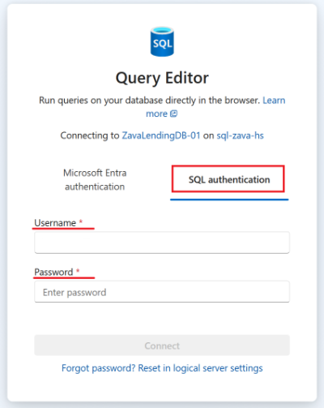

1. Select **Connect** to connect.
2. Confirm that the query editor shows your assigned `ZavaLendingDB-No` database as the current database.

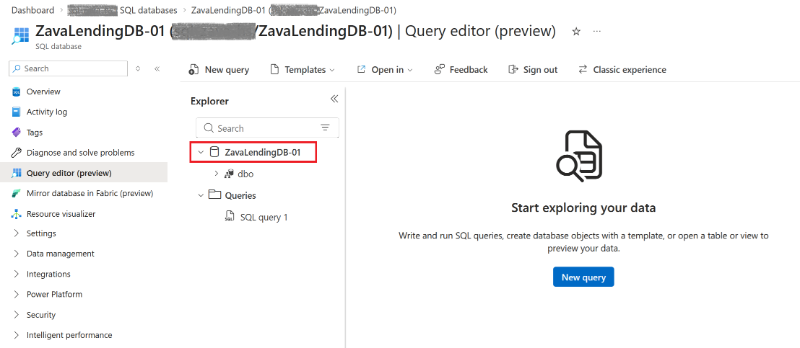

Keep the query editor open for the next section.

> [!NOTE]
> If Query Editor cannot connect, ask the instructor to verify that public network access and the logical server firewall settings permit the connection. Query Editor is optional, so you can continue the exercise in SSMS.

## 2. Create a recovery marker

You will create test data and then delete it to simulate an accidental change.

1. Run the following script on your `ZavaLendingDB-No` database

```sql
  -- Remove the existing PITR marker table, if present,
  -- so the script can be run multiple times.
  IF OBJECT_ID(N'dbo.PitrWorkshopMarker', N'U') IS NOT NULL
      DROP TABLE dbo.PitrWorkshopMarker;
  GO

  -- Create a marker table that will be used to demonstrate
  -- point-in-time restore (PITR).
  CREATE TABLE dbo.PitrWorkshopMarker
  (
      MarkerId int NOT NULL PRIMARY KEY,
      MarkerText nvarchar(200) NOT NULL,
      CreatedAtUtc datetime2(0) NOT NULL
  );
  GO

  -- Insert a marker row and record the current UTC time.
  -- This helps identify the point in time to restore to.
  INSERT dbo.PitrWorkshopMarker (MarkerId, MarkerText, CreatedAtUtc)
  VALUES (1, N'Recover me with point-in-time restore', SYSUTCDATETIME());
  GO

  -- Verify that the PITR marker was successfully created.
  SELECT MarkerId, MarkerText, CreatedAtUtc
  FROM dbo.PitrWorkshopMarker;
```

1. Confirm that the result contains one row (example shown below, but you will have different data)

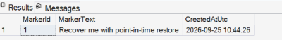

1. Wait approximately two minutes so that you can choose an unambiguous restore point.
2. Run the following query and record the returned UTC time:

```sql
  SELECT SYSUTCDATETIME() AS RestorePointUtc;
```

Restore point: `____________________________ UTC` -> **Please record the RestorePointUtc result of this query into a text file, as you will need it later on**

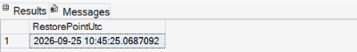

1. Wait one more minute, and then simulate accidental data loss:

```sql
  DELETE FROM dbo.PitrWorkshopMarker;

  SELECT COUNT(*) AS RowsAfterDelete
  FROM dbo.PitrWorkshopMarker;
```

1. Confirm that `RowsAfterDelete` is `0`.

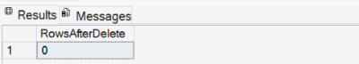

## 3. Restore the database in the Azure portal

### Select your database

1. Open the [Azure portal](https://portal.azure.com).
2. Search for your database using the Azure search box at the top of the portal. Enter the name of your SQL database, such is `ZavaLendingDB-01`, wait for it to appear in the search results, and then select it.

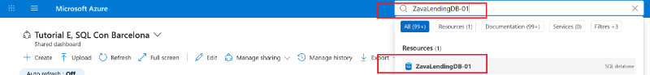

#### Alternative method (optional)

1. Access the **Azure SQL logical serve**r (the same screen as above to find out the server nane)
2. Expand the menu **Settings**
3. Click on **SQL Databases** menu item
4. Locate your database, such is `ZavaLendingDB-01` and select it

### Perform Point in Time Restore

1. On the database **Overview** page, select **Restore** on the toolbar.

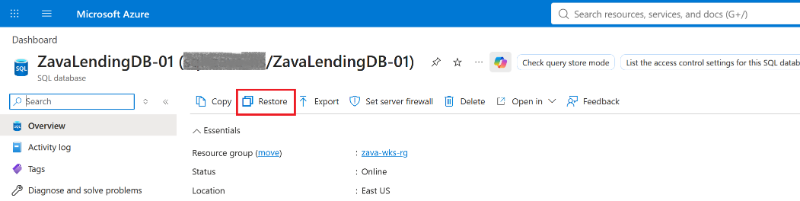

1. On **Create SQL Database - Restore database**, confirm that **Restore point** is set to **Point-in-time**.
2. For **Restore point (UTC)**, enter the time stamp you recorded before deleting the marker row. In the example above, the query returned 2026-09-25 10:45:25, so the example screenshot below shows this time stamp.
3. For **Database name**, enter `<database-name>-pitr-restored`. So for example, if your assigned database was `ZavaLendingDB-01`, then type `ZavaLendingDB-01-pitr-restored`
4. For Want to use **SQL elastic pool**, select **Yes**
5. Select the **elastic pool** where your database was provisioned:
  - If your database name is one of `ZavaLendingDB-01` through `ZavaLendingDB-20`: select `hs-zavapool-01` instance pool
  - If your database name is one of `ZavaLendingDB-21` through `ZavaLendingDB-40`: select `hs-zavapool-02` instance pool
  - If your database name is one of `ZavaLendingDB-41` through `ZavaLendingDB-60`: select `hs-zavapool-03` instance pool
6. Select **Review + create**.
7. Click on **Create**
  - This operation starts a deployment procedure which creates a new database, in our example `ZavaLendingDB-01-pitr-restored` from the provided restore point
8. Please **wait** for the deployment operation to complete. Do not navigate away from this page.

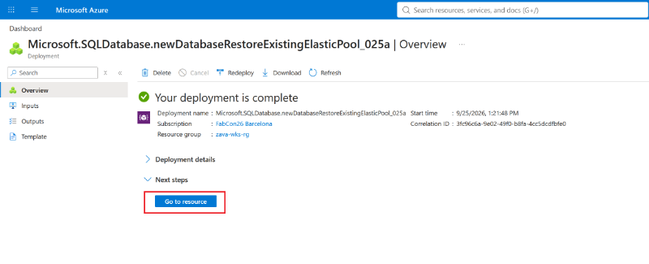

## 4. Monitor and validate the restore

1. On the completed deployment page, select **Go to resource**.
  - If you navigated away from the deployment page, search for your restored database in the Azure search box using `ZavaLendingDB-No-pitr-restored`, and then select it.
2. Wait until **Status** is **Online**.

> [!NOTE]
> The restored database appears in the database list while recovery is in progress. Do not delete it or the restore operation will be canceled.

1. When the "Your deployment is complete" page shows, note the time on your computer's clock and the start time shown on the page. Subtract the two and record the approximate restore duration: `____________________________`.
2. On the overview page of the newly restored database, select **Query Editor (preview)**.
3. Select the `SQL authentication` method, and enter credentials provided for the workshop.
4. Select **New Query**, and then run the following query:

```sql
   SELECT MarkerId, MarkerText, CreatedAtUtc
   FROM dbo.PitrWorkshopMarker;
```

1. Confirm that the deleted row is present in the restored database `ZavaLendingDB-01-pitr-restored`.

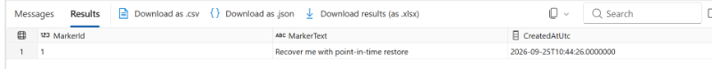

1. Switch back to the original database, for example `ZavaLendingDB-01`.
2. Run the same query. Confirm that the original database still has no rows in the marker table.

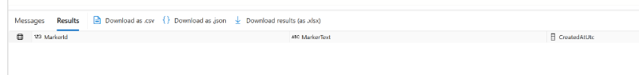

You have recovered the state from before the accidental delete without replacing or interrupting the original database. In a production recovery, you could validate the restored data and then copy only the required rows back to the original database, or plan a controlled database replacement.

> [!NOTE]
> - The default short-term retention period for a Hyperscale database is 7 days and can be configured from 1 through 35 days.
> - Long-term retention (LTR) can retain selected backups for up to 10 years.
> - PITR and LTR are managed by Azure; you don't run `BACKUP DATABASE` or access backup files directly.

# Exercise 2: Offload read workloads to a Hyperscale named replica

A named replica is an independently addressable, read-only Azure SQL database that shares the primary Hyperscale database's page servers. No full data copy is required, so a named replica is commonly created in about a minute. You can use a separate connection string for reporting, analytics, extract processes, or other read-only workloads.

Named replica characteristics include:

- Up to **30 named replicas per primary Hyperscale database**.
- A separate database name and, optionally, a different logical server in the same Azure region.
- An independently configurable service objective and compute size.
- Independent scaling: scaling a named replica doesn't disconnect users from the primary, and scaling the primary doesn't disconnect users from the named replica.
- Always read-only access; `ApplicationIntent=ReadOnly` isn't required when connecting directly to it.
- Asynchronous log application, so a busy or undersized named replica can lag behind the primary.
- Separate compute charges for every named replica; shared page servers mean there is no separate data copy to seed.

> [!IMPORTANT]
> A named replica cannot be added to a Hyperscale elastic pool. In this exercise, the source database can be in the workshop Hyperscale elastic pool, but the named replica must be created as a **standalone Hyperscale database**. Hyperscale elastic-pool high-availability replicas are a different feature: a pool can have up to four HA replica pools and read-intent connections are distributed among them.

## 1. Create a named replica

1. In the [Azure portal](https://portal.azure.com), search for  search for the primary database assigned to you `ZavaLendingDB-No`
2. On the overview page of your primary database, on the meny select **Data management**, then **Replicas**.
3. Select **Create replica**.

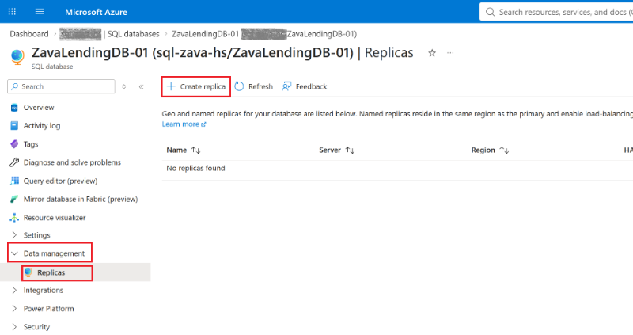

1. Under **Replica type**, select **Named replica**.
2. For **Named replica database name**, enter `<database-name>_NamedReplica`, in our example `ZavaLendingDB-01_NamedReplica`
3. For Server select **sql-zava-hs** (East US) server from the drop-down menu

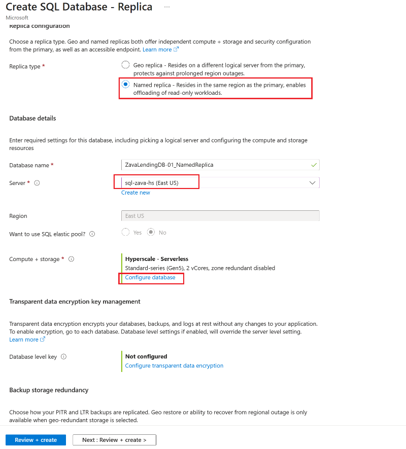

1. In the section **Compute + storage** click on **Configure database**

- For **Compute tier** select the **Serverless** option
- Choose the smallest instructor-approved compute size (2 vCores; 0 secondary replicas). In production, size the replica to keep up with the primary's log generation and the expected read workload; using the same number of vCores as the primary is the recommended starting point for write-intensive databases.
- Keep zone redundancy disabled. A zone-redundant named replica also requires at least one HA secondary replica.  
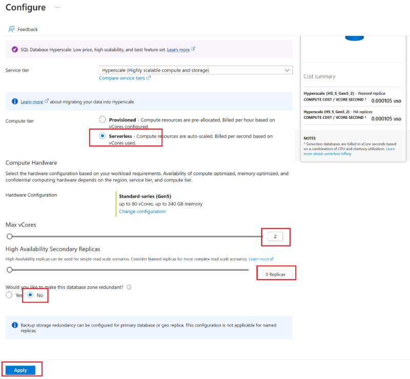

1. Select **Apply** if the compute page is open.
2. Select **Review + create**.
3. Review the estimated cost, and then select **Create**.

This will start the deployment of a named replica for your selected database.

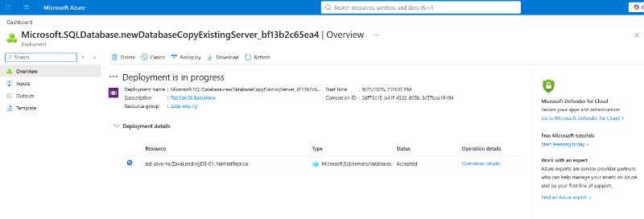

## 2. Verify the replica was added

1. After deployment completes, return to the **primary database** `ZavaLendingDB-No` (quick access through searching the database name in the Azure search field)
2. Under **Data management**, select **Replicas**.
3. Confirm that `ZavaLendingDB-No_NamedReplica` appears under **Named replicas**.

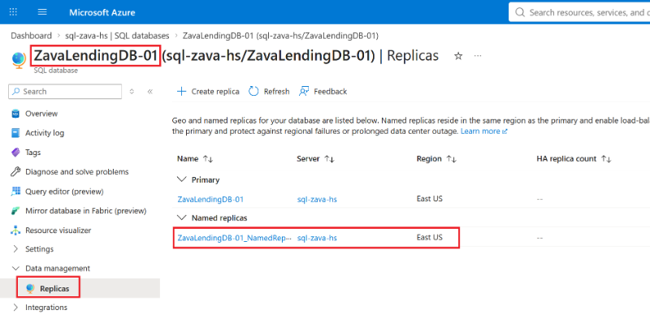  
4. Click on the Query Editor (preview), or alternatively use SSMS, to connect to the primary database and run:

```sql
   SELECT replica_role_desc, replica_server_name, replica_id
   FROM sys.dm_hs_database_replicas(DB_ID());
```

1. Open query editor on the named replica
2. Confirm that the results identify the primary and the named replica. If the query is denied, ask the instructor to run it with an account that has permission to view the replica metadata.
  - Please note that it will take several minutes for the named replica to show up after provisioning. If this is the case, proceed to the next step, and come back to this one in a few minutes.

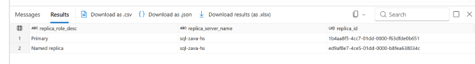

> [!IMPORTANT]
> - If the named replica appears in the Azure portal but is not returned by the query, it may still be provisioning. Wait a few minutes and run the query again.
> - Proceed to the next step.

## 3. Connect to the read-only replica

1. In the Azure portal, open `ZavaLendingDB-No_NamedReplica`
2. Select Query Editor (preview)
  - Alternatively, you can also connect via SSMS to the same server. Change the database name to the named replica, for example `ZavaLendingDB-No_NamedReplica`.
3. Run the following query to validate that named replica database os read-only:

```sql
 SELECT
   DB_NAME() AS DatabaseName,
   DATABASEPROPERTYEX(DB_NAME(), 'Updateability') AS Updateability,
   SYSUTCDATETIME() AS CheckedAtUtc;
```

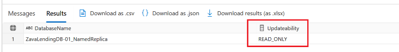

1. Then run the following query to access read only data

```sql
 SELECT TOP (10)
   s.name AS SchemaName,
   t.name AS TableName
 FROM sys.tables AS t
 INNER JOIN sys.schemas AS s
   ON s.schema_id = t.schema_id
 ORDER BY s.name, t.name;
```

1. Confirm that `Updateability` is `READ_ONLY` and that application tables are visible.
2. Compare the server and database in your application's primary connection string with the named replica values. To offload a read-only workload, configure that workload with the named replica's server and database name. No `ApplicationIntent=ReadOnly` keyword is required.

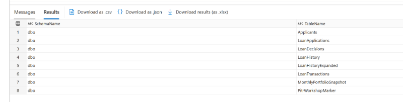

> [!TIP]
> Route only workloads that tolerate possible replication lag. Keep writes and read-after-write operations on the primary. Monitor replica lag and log-rate throttling before using a smaller compute size in production.

## 4. Delete the named replica after validation

Complete these steps after the instructor confirms that you no longer need the named replica. Exercises 3 and 4 use the replica for investigation, so keep it if you plan to complete those exercises.

> [!CAUTION]
> Verify that you selected `ZavaLendingDB-No_NamedReplica`, is not the primary database. Deleting a named replica permanently removes that replica and terminates its active connections, but it does not delete or interrupt the primary database.

1. Close any SSMS query windows connected to `ZavaLendingDB-No_NamedReplica`.
2. In the [Azure portal](https://portal.azure.com), search for and select **SQL databases**.
3. Select `ZavaLendingDB-No_NamedReplica`.
4. On the replica database **Overview** page, verify the database name, logical server, resource group, and subscription.
5. Select **Delete** on the toolbar.
6. When prompted, enter the full replica database name, `ZavaLendingDB-No_NamedReplica`, and then confirm the deletion.

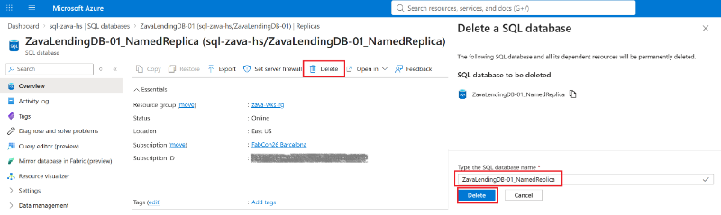

1. Wait for the deletion notification to report success.
2. Open the primary Hyperscale database, select **Replicas** under **Data management**, and then refresh the page.
3. Confirm that `ZavaLendingDB-No_NamedReplica` is no longer listed under **Named replicas** and that the primary database status remains **Online**.

# Exercise 3: Use GitHub Copilot in SSMS to Manage Azure SQL Database Hyperscale

GitHub Copilot in SSMS can explain database behavior, generate T-SQL, review execution plans, and help with administration. It uses the active query window as database context. Generated output can be inaccurate, so review every statement and understand its permissions and impact before you run it.

## 1. Open Copilot with the correct database context

1. In SSMS, open a query window connected to your **assigned primary database** `ZavaLendingDB-No`. Ensure that you are not connected to the `master` database.
2. Select the **GitHub Copilot** badge in the upper-right corner, and then select **Open Chat Window**.
3. Confirm that the active query window shows the intended logical server and database.
4. Use **Ask** mode for explanations and script generation. Do not use Agent mode to make changes during this exercise.

## 2. Investigate Hyperscale architecture and replicas

Submit this prompt:

```text
I am connected to an Azure SQL Database in the Hyperscale service tier.
Generate a read-only T-SQL script that identifies the server and database properties.
Use documented DMVs, explain every output column, and do not execute the script.
```

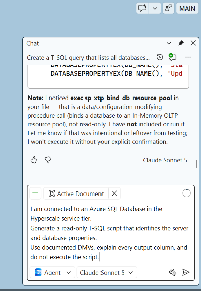

1. Review the response before running it.
2. Run only the read-only `SELECT` statement.
3. Compare the output with the named replica shown in the Azure portal.

Follow up with:

```text
Explain the differences among Hyperscale HA replicas, named replicas, and
geo-replicas. Include connection routing, failover behavior, independent
scaling, typical use cases, and current replica limits. Cite Microsoft Learn
sources.
```

## 3. Generate a workload diagnostic script

Submit this prompt:

```text
I am connected to an Azure SQL Database in the Hyperscale service tier.
Generate a read-only T-SQL diagnostic script for this Azure SQL Database
Hyperscale database. Show recent CPU, data I/O, log write utilization, worker
utilization, and session usage from sys.dm_db_resource_stats. Return the most
recent 15 minutes in chronological order, label percentages clearly, and do
not execute the script.
```

1. Check that the response contains only read-only statements.
2. Run the script against the primary database.
3. Ask Copilot to explain any sustained utilization near the service limit.

For a replica-focused follow-up, use:

```text
Generate a read-only Hyperscale script that helps determine whether a named
replica is falling behind the primary. Prefer documented Hyperscale DMVs or
functions, explain the permissions required and each lag-related value, and
do not execute the script.
```

## 4. Ask about backup retention, the last backup, and the latest recoverable point

Backup policies and available restore points are Azure resource properties, not traditional `msdb` backup history. Use this prompt to test whether Copilot distinguishes the database engine from the Azure management plane:

```text
For this Azure SQL Database Hyperscale database, explain how I can find its
short-term PITR retention, configured LTR policy, available LTR backups, last
available backup or snapshot time, and latest recoverable point. First explain
what "last backup taken" means for Hyperscale snapshot-based backups and state
which values can and cannot be obtained reliably with T-SQL in SSMS. Then
provide read-only Azure portal and Azure CLI methods with placeholders. Do not
change any policy and do not execute commands.
```

Review the response for these points:

- Hyperscale uses snapshots and retained transaction logs rather than user-managed full, differential, and log backup files.
- Short-term PITR retention is 1 through 35 days; the default is 7 days.
- LTR can retain selected backups for up to 10 years.
- Azure controls backup timing, and the most recent recoverable point can lag current time.
- Management-plane commands require Azure RBAC and are different from T-SQL permissions inside the database.

Try one additional prompt based on your role:

```text
Create a production review checklist for Azure SQL Database Hyperscale backup
retention. Cover PITR, LTR, storage redundancy, geo-restore eligibility,
restore drills, access control, cost, and evidence that an auditor should
request. Cite Microsoft Learn sources.
```

```text
Generate a read-only Query Store script that finds the ten queries with the
highest average duration in the last hour on this Azure SQL Database. Include
execution count, average duration, total duration, query text, and plan ID. Do
not execute it.
```

```text
Review the selected T-SQL query for Azure SQL Database Hyperscale. Explain
whether it benefits from read-only offload to a named replica, identify any
read-after-write consistency risk, and suggest indexes only when supported by
evidence from the execution plan.
```

# Exercise 4: Advanced (Optional): Manage Azure SQL Database Hyperscale with GitHub Copilot in VS Code

These exercises use GitHub Copilot for Azure and Azure MCP Server to work with Azure management-plane resources. Complete them only if you configured the advanced prerequisites in Module 0.

> [!CAUTION]
> Copilot can generate and, in Agent mode, run commands that change resources and create cost. Begin with read-only inventory. For every proposed change, require a plan and command preview, verify the subscription and resource group, and authorize execution only when the instructor directs you to do so. Never paste passwords, access tokens, or connection strings into chat.

## 1. Establish and verify Azure context

1. Open Visual Studio Code.
2. Open **Chat** and select **Agent** mode.
3. Confirm that the Azure MCP Server tools are enabled.
4. Submit this prompt:

```text
Check whether I am signed in to Azure. If authentication is required, launch
the external system browser for sign-in. Then show my current tenant,
subscription name, and subscription ID. Do not change the active subscription
or any Azure resource.
```

1. Confirm that the subscription matches the value recorded in **Before you begin**.
2. If it doesn't match, ask Copilot to switch to the instructor-provided subscription, and then verify the context again before continuing.

## 2. Inventory the Hyperscale estate

Submit this prompt, replacing the placeholders:

```text
In Azure subscription <subscription-name>, inspect resource group
<resource-group>. List every Azure SQL logical server, Hyperscale elastic pool,
and SQL database. For each database show its server, service tier, compute
model, elastic pool membership, location, status, zone redundancy, and tags.
This is read-only: do not modify resources. Use Azure Resource Graph or Azure
management APIs and summarize anything that cannot be determined.
```

Validate that Copilot:

- Uses the requested subscription and resource group.
- Separates standalone databases from pooled databases.
- Identifies the primary, PITR copy, and named replica created in this module.
- Doesn't expose credentials or connection strings.

## 3. Audit backup and retention configuration

Submit this prompt:

```text
Perform a read-only backup governance audit for every Azure SQL Database in
resource group <resource-group>. Show short-term PITR retention, LTR policy,
available LTR backups and their dates when accessible, backup storage
redundancy, and whether geo-restore is available. Flag databases with no LTR
policy or retention shorter than 7 days. Do not change settings. Include the
Azure CLI commands or Azure MCP tools used and cite Microsoft Learn
documentation.
```

Review the findings with the instructor. A missing LTR policy isn't automatically a defect; the required retention depends on business and compliance requirements.

## 4. Generate a named replica deployment plan

This task demonstrates change planning without creating another billable replica.

```text
Prepare, but do not execute, a plan to create a standalone Hyperscale named
replica named <database-name>-analytics from pooled primary database
<database-name> on server <server-name> in resource group <resource-group>.
Verify current product constraints, explain why the named replica cannot be
placed in the Hyperscale elastic pool, recommend an initial compute size,
estimate cost considerations, and generate the Azure CLI command with
placeholders where information is missing. Include validation, monitoring,
rollback, and cleanup commands. Wait for explicit authorization before any
write operation.
```

Check that the plan uses a named secondary replica, keeps it in the same region, and doesn't attempt to add it to an elastic pool.

## 5. Investigate operations and activity logs

Submit this prompt:

```text
For Azure SQL database <database-name> in resource group <resource-group>,
perform a read-only investigation of management-plane operations from the last
24 hours. Show restores, scaling, replica creation or deletion, policy changes,
failures, and the initiating identity when available. Correlate database
operations with Azure Activity Log events. Do not modify resources.
```

Use the result to identify the PITR and named replica operations from this module. Ask Copilot to explain any failed operation, but don't let it retry a write operation automatically.

## 6. Design an administrator runbook

Submit this final prompt:

```text
Create a Markdown runbook for administrators of this Azure SQL Database
Hyperscale environment. Include daily health checks, named replica lag checks,
PITR and LTR policy checks, a quarterly restore drill, capacity and cost review,
alerting recommendations, least-privilege RBAC, escalation criteria, and cleanup
of temporary restored databases. Generate read-only verification commands first
and place every write command in a separate clearly marked approval-required
section. Do not execute anything.
```

Save the generated runbook only if the instructor asks you to retain it. Treat it as a draft that requires technical and security review.

# Cleanup

Delete workshop resources only after the instructor confirms that validation is complete.

1. In the Azure portal, open **SQL databases**.
2. Select `<database-name>-pitr-restored`, select **Delete**, enter the database name when prompted, and confirm the deletion.
3. If `<database-name>_NamedReplica` still exists, delete it by following [Delete the named replica after validation](#4-delete-the-named-replica-after-validation).
4. In SSMS, connect to the original primary database and remove the marker table:

```sql
  DROP TABLE IF EXISTS dbo.PitrWorkshopMarker;
```

1. Return to the primary database's **Replicas** page and confirm that the workshop named replica is no longer listed.

> [!NOTE]
> Deleting the primary database automatically removes its named replicas. Deleting a named replica doesn't delete or interrupt the primary database.

# Learn more

- [Automated backups for Hyperscale databases](https://learn.microsoft.com/azure/azure-sql/database/hyperscale-automated-backups-overview)
- [Restore a database from a backup in Azure SQL Database](https://learn.microsoft.com/azure/azure-sql/database/recovery-using-backups)
- [Hyperscale secondary replicas](https://learn.microsoft.com/azure/azure-sql/database/service-tier-hyperscale-replicas)
- [Configure and manage Hyperscale named replicas](https://learn.microsoft.com/azure/azure-sql/database/hyperscale-named-replica-configure)
- [Hyperscale elastic pools overview](https://learn.microsoft.com/azure/azure-sql/database/hyperscale-elastic-pool-overview)
- [GitHub Copilot in SSMS](https://learn.microsoft.com/ssms/github-copilot/overview)
- [GitHub Copilot for Azure](https://learn.microsoft.com/azure/developer/github-copilot-azure/introduction)

# What's next

Congratulations! 🎉

You recovered Hyperscale data with point-in-time restore, created and tested a named replica for read-only workload offload, and used GitHub Copilot in SSMS to investigate Hyperscale behavior. If you completed the advanced exercises, you also used GitHub Copilot in Visual Studio Code to inspect Azure SQL resources and prepare operational plans and runbooks.

Next, continue to [Module 5 - SQL and Fabric](../Module%205%20-%20SQL%20and%20Fabric/README.md).
