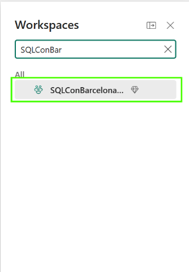
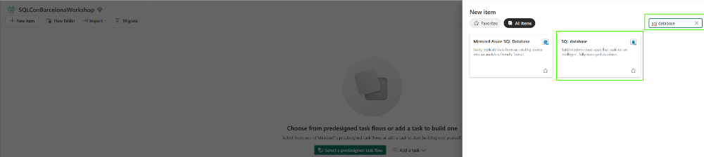
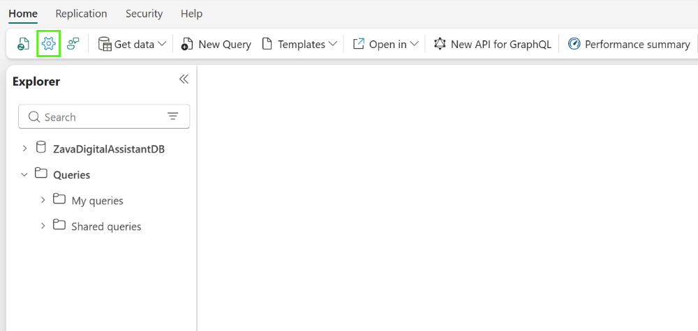
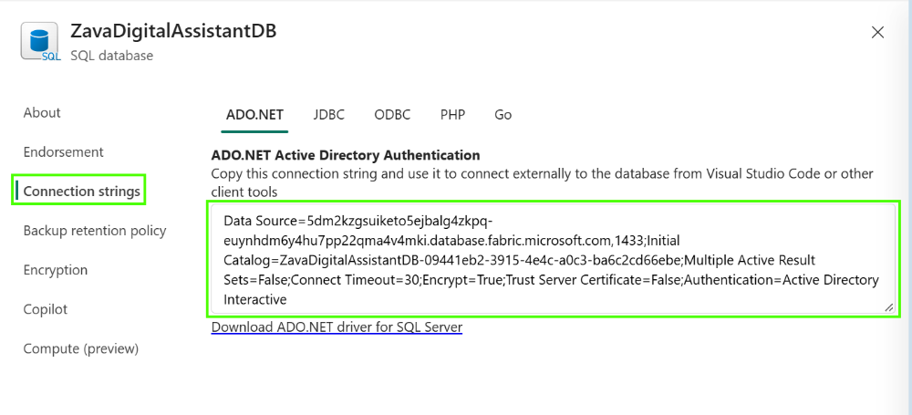

# Create Your Fabric Database

In this section, you will create SQL database in Microsoft Fabric workspace dedicated to this workshop. This database will store the banking app's conversations and support requests.

## Section 1: Create your SQL database

### Task 1.1: Sign in to Fabric

1. Open [Microsoft Fabric](https://app.fabric.microsoft.com/) in your browser.
2. Sign in with your workshop account and check that you are in the supplied **Fabric tenant**. Use an InPrivate window if your browser is already signed in with another account.

### Task 1.2: Find workspace

1. Search for SQLConBarcelona in the list of workspaces and select it.



### Task 1.3: Create an empty database

1. Inside your workspace, select **+ New item**.
2. Search for **SQL**, then select **SQL database**.
3. Enter `ZavaDigitalAssistantDB-<attendeeID>` and select **Create**.
4. Wait for the database to open.



### Task 1.4: Find the connection details

1. Open the database's **Settings > Connection strings**.



2. Find the **SQL database** connection and note its **server hostname** and **database name**. Copy them as you will use these in the next exercise.

**Note**: Data Source (Server) and Initial Catalog (Database) names will likely vary on your screen.



> [!IMPORTANT]
> Use the **SQL database**, not the **SQL analytics endpoint**. The Digital Assistent app needs to write data to the database.

### Task 1.5: Try the query editor and populate initial data

1. Select **New SQL query** in your SQL database.
2. Open **[initialize.sql](../../banking/database/initialize.sql)** file, copy the script, and paste it into the query window.
3. Paste the following query and select **Run.**
4. Open New SQL query editor and run the following script and navigate between 3 results sets in Result pane:
  ```sql
  SELECT TOP 10 * FROM dbo.FaqEntries;
  ```

**Check:** Your database is ready, and you have its hostname and database name.

## Next steps

You can now continue to [Run the Banking App](../03%20-%20Run%20the%20Banking%20App/03%20-%20Run%20the%20Banking%20App.md).
