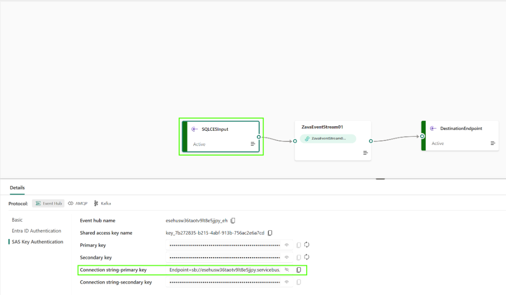
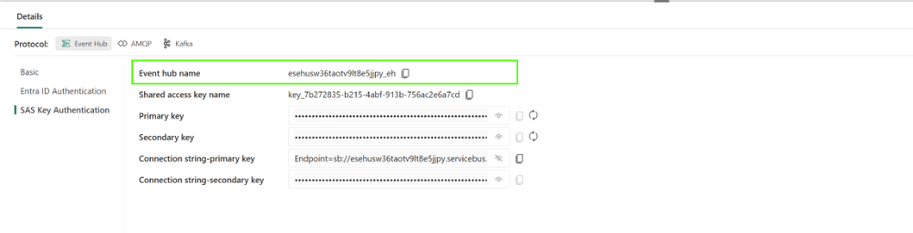
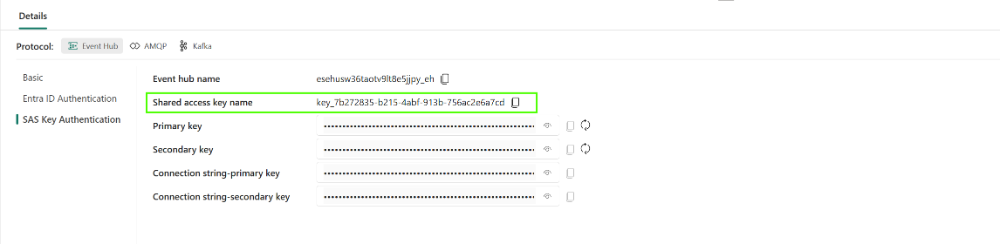
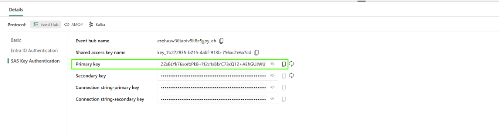

# Enable Change Event Streaming

In this section, you will enable **Change Event Streaming (CES)** on your Fabric SQL database. CES sends changes from the `ChatEscalations` table to Event Hubs without the banking app publishing events itself.

## Section 1: Prepare the SQL script

### Task 1.1: Fill in your destination details

1. In Fabric, open your **SQL database**, not its SQL analytics endpoint.
2. Select **New SQL query** under **My queries**.
3. In VS Code, open [database/enable-ces.sql](../../banking/database/enable-ces.sql) and copy its contents into the Fabric query editor.
4. Replace the five values at the top of the query:

  | Variable             | Value                                                                               |
  | -------------------- | ----------------------------------------------------------------------------------- |
  | `@HubNamespace`      | Your supplied Event Hubs namespace hostname, **without a protocol prefix or port**. |
  | `@HubName`           | Your supplied hub name                                                              |
  | `@KeyName`           | Your supplied Send-only policy name                                                 |
  | `@PolicyKey`         | Your supplied key value, not a full connection string                               |
  | `@MasterKeyPassword` | Choose a strong, unique password for this database's master key and keep it private |

  Keep the surrounding `N'...'` syntax and leave the rest of the script unchanged. If a value contains a single quote, double it inside the SQL string.

> [!IMPORTANT]
> Fabric automatically saves query text. Keep this query in **My queries**, never share or screenshot it, and do not put the filled-in values in the repository file. You will remove the saved query after running it.

### Step by step instructions to populate T-SQL parameters from Eventstream parameters in Fabric portal

1. Login to Fabric portal and select Evenstream **ZavaEventStream01**.
2. Select SQLCESInput component
3. For @Hubnamespace, unhide **Connection string primary-key field**, copy it locally.

Remove **Endpoint=sb://** from the begining and everything after **servicebus.windows.net** and use remaining text to set @Hubnamespace in T-SQL script.

4. For @Hubname copy **Event hub name** and assign.

5. For @KeyName copy **Shared access key name** and assign.

6. For @PolicyKey unhide **Primary key **and assign.

## Section 2: Enable and check CES

### Task 2.1: Run the script

1. Open `ZavaDigitalAssistantDB-<attendeeID> `database in Fabric portal and select **New SQL query**
2. Open **[enable-ces.sql](../../banking/database/enable-ces.sql)**, copy the script, and paste it into the query window. Select **Run** to execute the **whole script**, not just selected lines.

The script performs three steps:

1. Creates a database credential for sending to Event Hubs.
2. Enables CES and creates the `ZavaEscalations` stream group.
3. Adds only `dbo.ChatEscalations` to that group.

You can safely rerun the completed script: it refreshes the credential and skips CES objects that are already configured. In **Results**, look for `is_event_stream_enabled = 1` and the change-feed information for `ChatEscalations`.

> [!NOTE]
> If the script fails, correct the reported issue and run the whole script again. It resumes safely when earlier steps have already completed.

After execution, replace the secrets with placeholders, wait for the query to save, and delete it from **My queries** using its **...** menu. Closing the tab alone does not delete it. If execution failed, do this with your helper too.

### Task 2.2: Check the streaming configuration

1. Open a new query in the same database.
2. Copy and run [database/monitor-ces.sql](../../banking/database/monitor-ces.sql).
3. Use the results selector to check that CES is enabled and the change-feed information links `dbo.ChatEscalations` to `ZavaEscalations`.

**Check:** CES is enabled for your escalation table. If the monitor reports errors, ask a helper before continuing.

> [!NOTE]
> CES captures new changes; it does not send previously created escalations. You will create a fresh request in the next exercise.

## Next steps

You can now continue to [Trace Your Escalation](../05%20-%20Trace%20Your%20Escalation/05%20-%20Trace%20Your%20Escalation.md).
