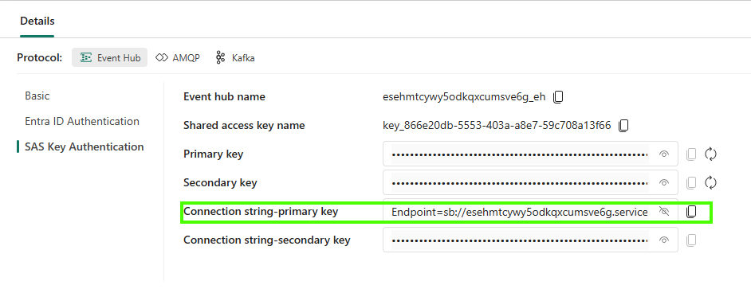
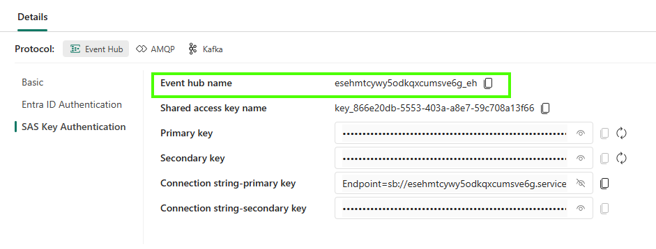
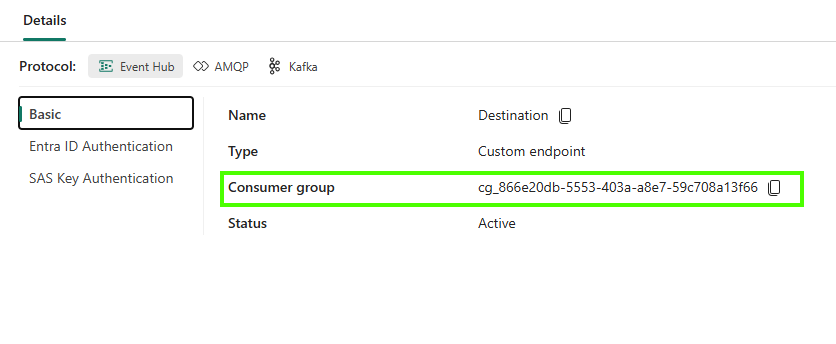

# Trace Your Escalation

Now that CES is enabled, you will create a conversation and request support. You will follow that request from your SQL database to the instructor's Zava Support app.

## Section 1: Try the banking chat

### Task 1.1: Start a conversation

1. Return to the banking page and select **Ask Zava**. If you already have a conversation open, select **New chat**.
2. Ask the following question and wait for the reply:

   ```text
   What savings options does Zava illustrate?
   ```

3. Then ask:

   ```text
   How can I think about a savings goal?
   ```

4. Look at the FAQ source links in the replies. Keep this chat open for the follow-up request below.

### Task 1.2: See the messages in SQL

In Fabric's SQL database query editor, run:

```sql
SELECT TOP (4) SessionId, Sequence, Role, Status
FROM dbo.ChatMessages
ORDER BY CreatedAt DESC;

SELECT COUNT(*) AS EscalationCount FROM dbo.ChatEscalations;
```

You should see two user messages and two assistant replies with `Completed` status. On a fresh run, the escalation count is still `0`: chatting alone does not create a support request.

## Section 2: Request support

### Task 2.1: Submit your follow-up request

1. In the same chat, select **Chat with a real person**.
2. Enter a fictional email using your attendeeID, for example `attendee001@example.com`.
3. Select **Request follow-up**.
4. When **Request recorded** appears, copy the full reference shown beneath it. You will use this to find your request.

The request stores your conversation in `ChatEscalations` and closes the chat. No real email is sent.

### Task 2.2: Find the request in SQL

In a new Fabric SQL query, replace `<your-escalation-reference>` with the reference you copied, keep the quotes, and run:

```sql
SELECT EscalationId, SessionId, CreatedAt
FROM dbo.ChatEscalations
WHERE EscalationId = '<your-escalation-reference>';
```

You should see one row with your reference.

Remember your escalation reference and email address - you will need them in the next section to find your request in the Support app.

## Section 3: See CES in action

### Task 3.1: Run Customer Support App (ZavaSupport)

The Customer Support App (ZavaSupport) can be run in two ways - from a deployable package or from the VS Code project. Both are explained in the [README](../../../README.md).

#### How to set .env configuration parameters?

**Option 1 - reading from Fabric Event Streams**

The parameters can be copied directly from the Fabric portal. Make sure that you select the **Destination** component first.


- To set `ZAVA_EVENTHUB_NAMESPACE` (remove **Endpoint=sb://** from the begining and everything after **servicebus.windows.net**):



- To set `ZAVA_EVENTHUB_NAME`:



- To set `ZAVA_EVENTHUB_CONNECTION_STRING`:


- To set `ZAVA_EVENTHUB_CONSUMER_GROUP`:



**Option 2 - reading from shared configuration file**

Alternatively, the parameter values are available in the shared workshop configuration file. See [Secrets and other configuration parameters](<../../../../../Module 1 - Introduction and Setup/Secrets and other configuration parameters.md>) for how to access it.

### Task 3.2: Find your request in the Support app

All app instances in the workshop share the same Fabric EventStream endpoint, so every attendee's escalations flow into the same stream. Use your email or escalation reference to filter for the ones you created.

1. Run CustomerSupport App
2. You can use Escalation reference or email to find escalation that you created in the Digital Assistant (ZavaBanking) app.
3. Compare the full reference with your SQL result to confirm that it is your request.

**Check:** The same reference appears in SQL and the Support app. Your SQL change has reached Event Hubs through CES.

If a chat reply fails, use its retry control. If your request does not appear in Support, check that it was created after CES was enabled and ask a helper to review [database/monitor-ces.sql](../../database/monitor-ces.sql) with you.

### Task 3.3: Test CES and Fabric Event Hub at scale

1. Use the [seed-chat-scenarios.sql](../../banking/database/seed-chat-scenarios.sql) script to simulate questions from many users. Verify that the events flow to the Customer Support App (ZavaSupport). The same data will be used in the next set of exercises.

## Next steps

Keep your workspace and database for the next workshop exercise. Access ends after today's workshop.

1. [Go to Zava new insights through connected data sets](<../../../../Zava new insights through connected data sets/README.md>)