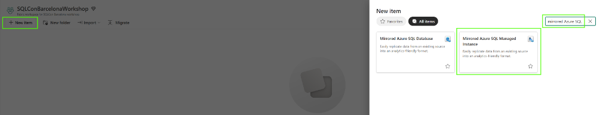
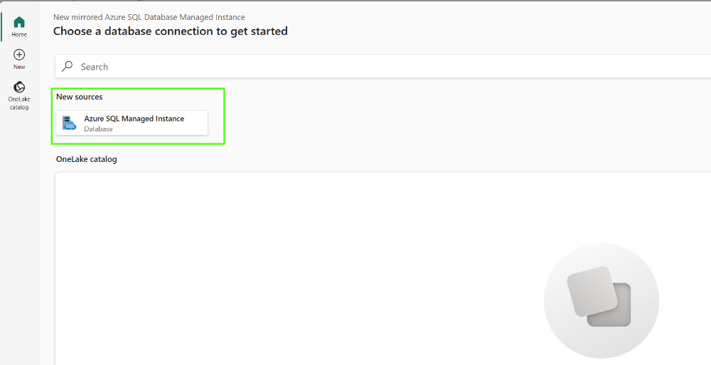
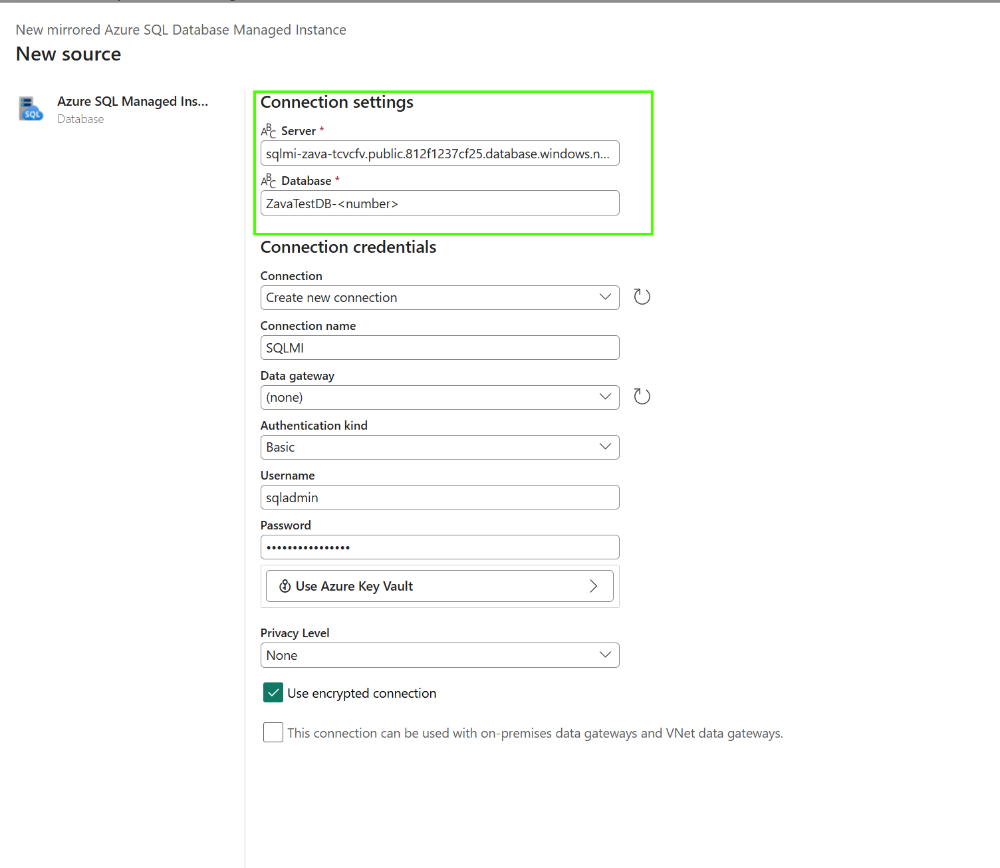
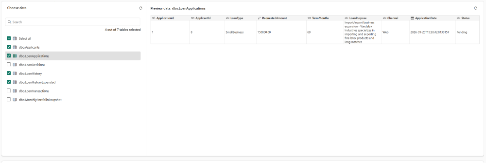
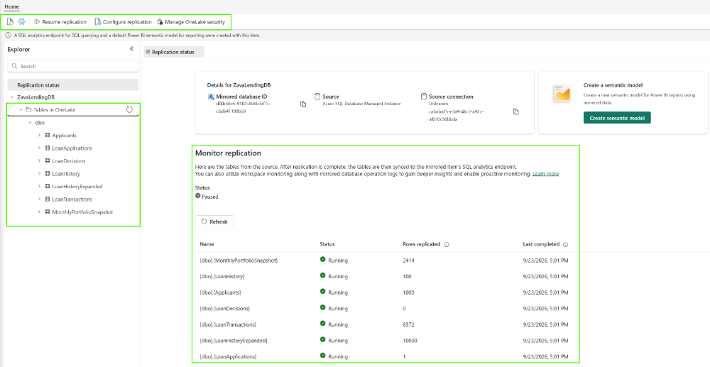
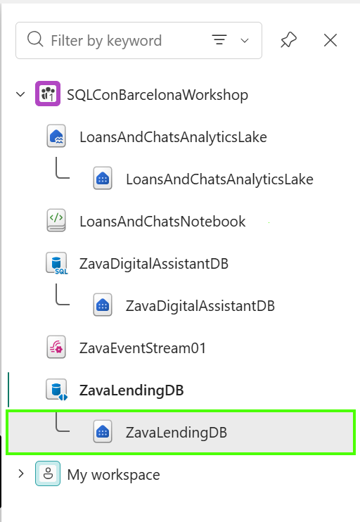
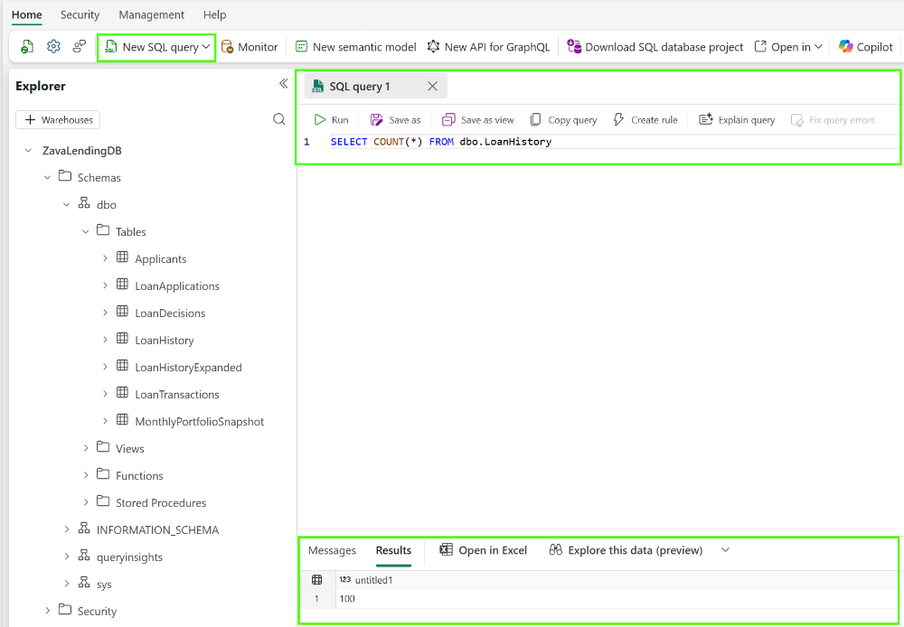

# Mirroring SQL database to Fabric (step by step)

In this section, you will setup mirroring for your database hosted on Azure SQL to Fabric One lake.

Login to Fabric portal, find your workspace and follow step by step instructions:

1. Select New item, search for mirrored Azure SQL and select Mirrored Azure SQL Managed Instance

2. On the next screen (Choose a database connection to get started), select Azure SQL Manage Instance

3. Enter Connection setting parameters (Server, Database), choose Basic authentication with username and password created for this workshop. Check out  Secrets and other configuration parameters section.

4. Once connection is established, select tables to be mirrored in One Lake.  For this exercise select **Applicants**, **LoanApplications**, **LoanHistory** and **LoanHistoryExpanded** (as shown on the picture).

5. It is going to take some time for data to get mirrored. You can monitor state of mirroring and manage it on the **Replication status** blade in Fabric portal

### Querying mirrored data

1. Open **SQL analytics endpoint** to query mirrored data

2. Select **New SQL query** and run simple query on the mirrored data

