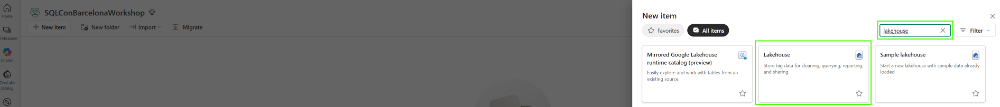
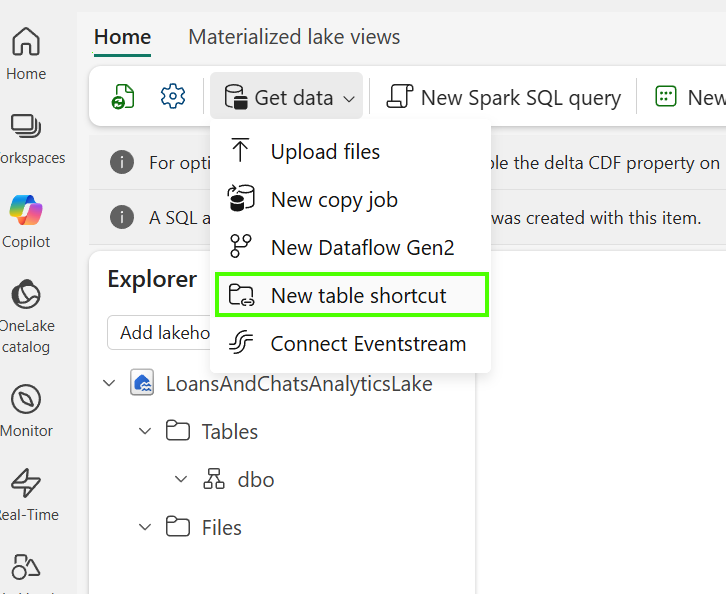
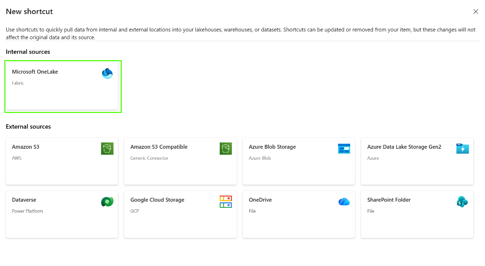
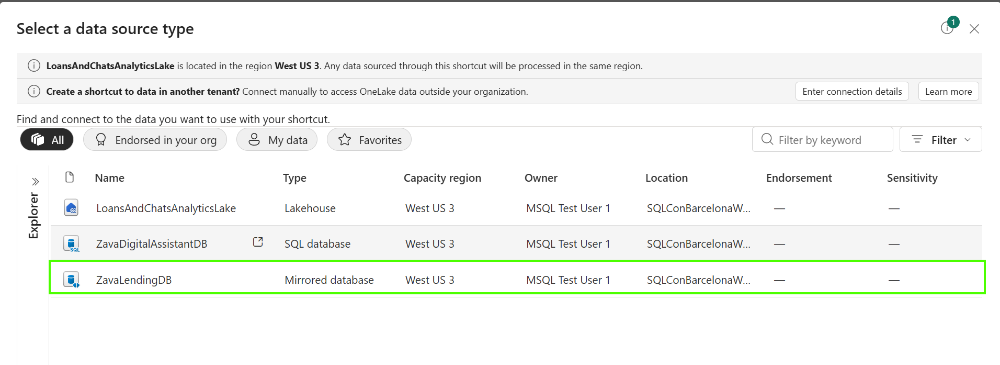
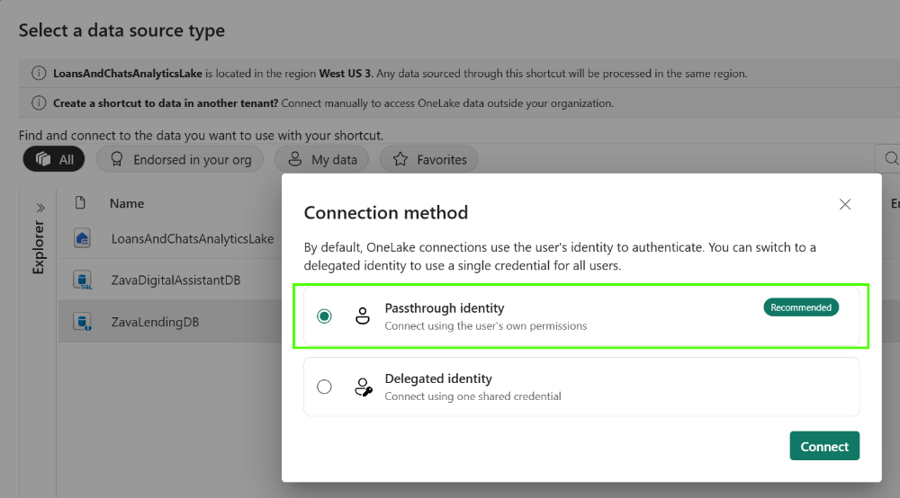
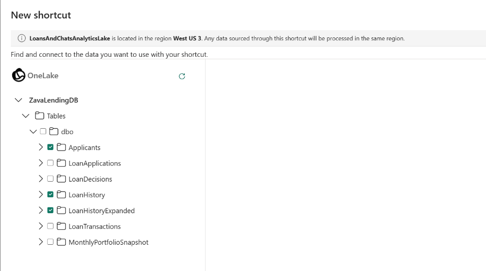
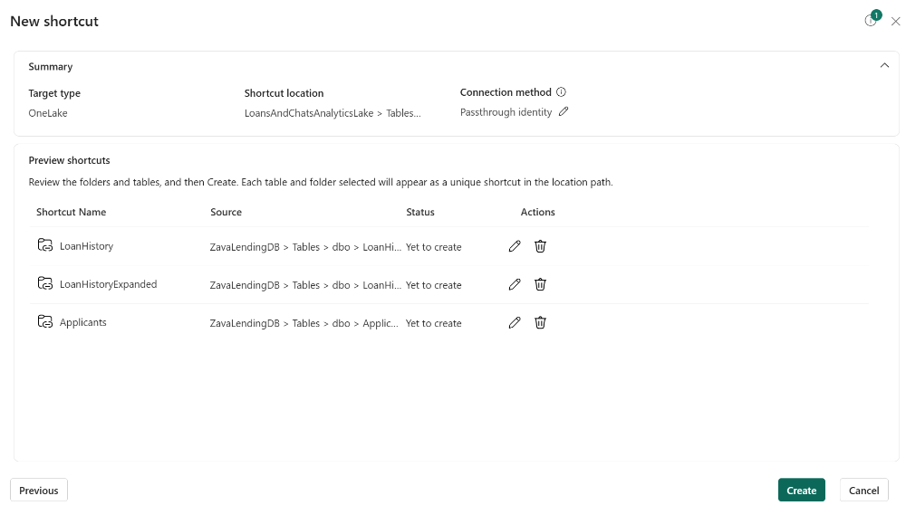
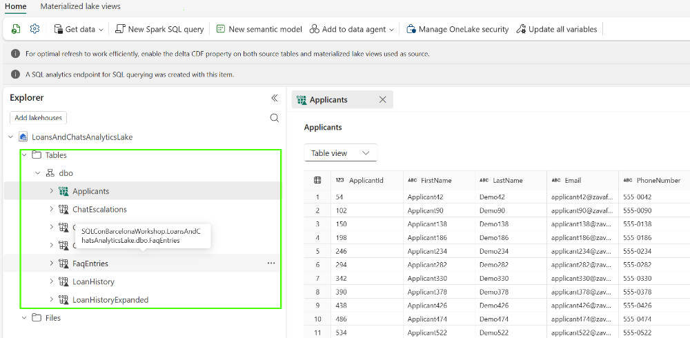

# Create Lakehouse to connect two data sources and generate actionable insights

## About the Lakehouse in Fabric

A Lakehouse in Microsoft Fabric is a unified data platform that combines the scalability and low-cost storage of a data lake with the structured querying and management capabilities of a data warehouse.

It stores data in open Delta Lake format within OneLake and enables users to work with the same data using SQL, Spark, notebooks, data pipelines, machine learning, and Power BI.

Organizations typically use Lakehouses when they need to consolidate data from multiple sources, perform large-scale data engineering and analytics, build AI and machine learning solutions, or create a shared foundation for reporting and business intelligence across teams.

## Step by step instructions to create Lakehouse

Login to Fabric portal, find your workspace and follow step by step instructions:

1. Select New item, search for "Lakehouse" and select it.

2. Get data to your Lakehouse. In our case we will create **shortcuts **towards the data already in One Lake

3. Select One Lake from the list of sources

4. Next step is to select data source.

5. Choose **Passthrough identity** connection model.

6. Select tables as shown on the picture (**Applicants**, **LoanHistory** and **LoanHistoryExpanded**)

7. Finally, confirm shortcut creation.

In the above steps we demonstrated data mirrored from **ZavaLendingDB **database, but step has to be repeated for **ZavaDigitalAssitant** (select **ChatSessions**, **ChatMessages** and **ChatEscalations** tables)

One setup is finished, you can explore state of your Lakehouse in **Explorer**:

