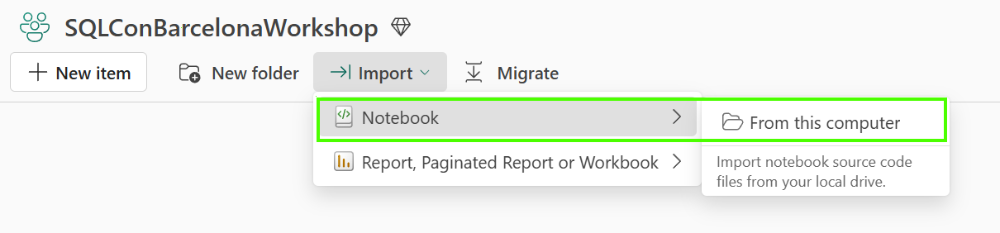
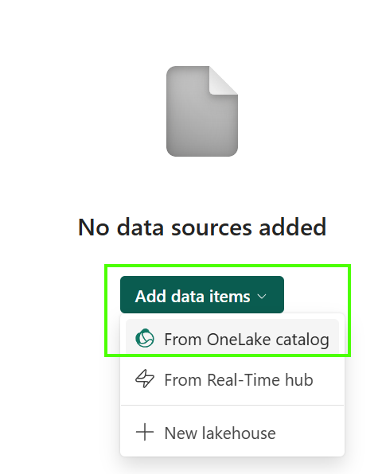
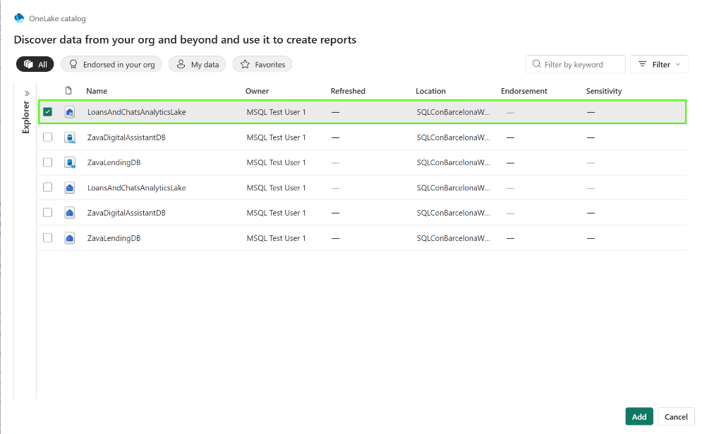

# Create Notebook in Fabric to perform analysis cross data sets

## About Notebooks in Fabric

A Notebook in Microsoft Fabric is an interactive development environment that allows users to write and execute code, typically in Python, PySpark, Spark SQL, or Scala, to analyze, transform, and enrich data stored in Fabric.

Notebooks are commonly used for data engineering, data science, AI/ML workloads, and advanced analytics, enabling users to process large datasets, create embeddings, train machine learning models, automate data preparation, and combine information from multiple Fabric sources.

In many scenarios, a Notebook acts as the compute layer that reads data from a Lakehouse or mirrored databases, applies business logic or AI processing, and writes the results back for reporting and visualization in Power BI.

## Step by step instructions to create Notebook

In this exercise we will import notebook already prepared for the workshop. It contains initial scripts which you can execute, but also modify as you find fit.

Login to Fabric portal, find your workspace and follow step by step instructions:

1. Find Jupyter source file LoansAndChats.ipynb in the repo
2. Click on Import button and then choose Notebook / From this computer

3. Click Add data items / From OneLake catalog to connect it to your previosly created Lakehouse

4. Select your Likehouse and your notebook is ready

## Next steps

1. [Perform analysis in Notebook](<../04 - Perform analysis in Notebook/Perform analysis in Notebook.md>)
