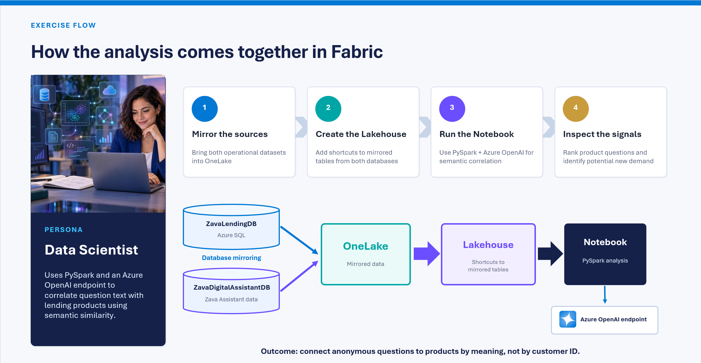

# Run analysis in Notebook

## Goals

In this exercise you step into the role of a Zava data analyst who uses Microsoft Fabric as a unified analytics platform to derive insights from diverse data sets - the core banking application (Azure SQL) and the Digital Assistant application. The goal is to understand how many of the questions arriving in the Digital Assistant app relate to Zava's banking loan offering, which products are popular, and which products customers ask about but Zava does not yet offer.

Notebooks are a convenient and agile mechanism for this kind of work: they let the analyst reach across multiple data sets, run analysis, and iterate quickly based on the output - all without leaving the main tool.

## Analysis flow



The scripts below illustrate each analysis step. Use them to build your own notebook, and customize them further as needed. The parameters for the external OpenAI endpoint come from workshop-level variables that are shared across the entire workshop.

1. Load all distinct questions from OneLake.

```python
#Script1: Load all distinct questions from user messages

questions_df = spark.sql("""
SELECT
    DISTINCT Content    
FROM ChatMessages WHERE Role = 'user'
""")
questions = questions_df.collect()
display(questions)
```

2. Prompt the Azure OpenAI endpoint to act as a banking classifier, giving it the additional context it needs to classify the questions correctly. For each question, ask the AI to determine semantic similarity to Zava's loan products and output an assessment result.

```python
#Script 2 - Foreach question invoke OpenAI endpoint and request it to behave 
#like a bank product classifier. Output of classification is displayed to human operator

import os
import json
import time
import requests

endpoint    = notebookutils.variableLibrary.get("$(/**/SQLConWorkshopVariables/OpenAIEndpoint)")  
deployment  = notebookutils.variableLibrary.get("$(/**/SQLConWorkshopVariables/OpenAIDeployment)")  
api_version = notebookutils.variableLibrary.get("$(/**/SQLConWorkshopVariables/OpenAIVersion)")  

url = f"{endpoint.rstrip('/')}/openai/v1/chat/completions"


# Do NOT hardcode secrets. Store the key in a Key Vault-backed secret or env var.
# In Fabric:  api_key = mssparkutils.credentials.getSecret('<keyvault>', '<secret>')
api_key = notebookutils.variableLibrary.get("$(/**/SQLConWorkshopVariables/OpenAIKey)")

available_products = ["Auto", "Personal", "SmallBusiness", "HomeImprovement"]

SYSTEM_PROMPT = (
    "You are a bank product classifier. Classify each customer question into exactly "
    "one of three outcomes and reply with STRICT JSON only (no markdown, no prose).\n\n"
    "Existing products: " + ", ".join(available_products) + "\n\n"
    "Outcomes:\n"
    "1. existing_product  -> the question relates to one of the existing products.\n"
    "2. new_product       -> the question relates to a banking product that is NOT in the list; suggest a concise product name.\n"
    "3. other_topic       -> the question is not about a product at all; suggest a short topic name.\n\n"
    "Respond with this JSON schema:\n"
    "{\n"
    '  "outcome": "existing_product | new_product | other_topic",\n'
    '  "product": "<existing product name, or suggested new product name, or null>",\n'
    '  "topic": "<short topic name when outcome is other_topic, else null>",\n'
    '  "confidence": <number between 0 and 1>,\n'
    '  "reason": "<one short sentence>"\n'
    "}"
)


def classify_question(question_text):
    resp = requests.post(
        url,
        headers={'api-key': api_key, 'Content-Type': 'application/json'},
        json={
            'model': "gpt-5.4-mini",
            'messages': [
                {'role': 'system', 'content': SYSTEM_PROMPT},
                {'role': 'user', 'content': f'Question: {question_text}'},
            ],
            'temperature': 0,
            'response_format': {'type': 'json_object'},
        },
        timeout=60,
    )
    resp.raise_for_status()
    raw = resp.json()['choices'][0]['message']['content']
    return json.loads(raw)


results = []
for question in questions:
    question_text = question['Content']
    try:
        result = classify_question(question_text)
    except (requests.RequestException, json.JSONDecodeError, KeyError) as err:
        result = {'outcome': 'error', 'product': None, 'topic': None,
                  'confidence': 0, 'reason': str(err)}

    result['question'] = question_text
    results.append(result)

    # Human-readable summary of the three outcomes
    if result['outcome'] == 'existing_product':
        summary = f"Related to product: {result['product']}"
    elif result['outcome'] == 'new_product':
        summary = f"Related to NON-EXISTING product (suggested): {result['product']}"
    elif result['outcome'] == 'other_topic':
        summary = f"Not product-related. Topic: {result['topic']}"
    else:
        summary = f"Error: {result['reason']}"

    print(f"Q: {question_text}")
    print(f"   -> {summary}  (confidence={result['confidence']})")
    print()
```


3. Iterate through the results and store them in another OneLake delta table for automated analysis via Power BI and other tools.

```python
#Script 3: All results of classification are written in a new table
# in Lakehouse for automated analysis and reporting

import os
import json
import time
import requests

from datetime import datetime, timezone
from pyspark.sql import SparkSession
from pyspark.sql.types import (
    StructType, StructField, StringType, DoubleType, LongType, TimestampType,
)

spark = SparkSession.builder.getOrCreate()

LAKEHOUSE_TABLE = "question_product_mapping"

run_ts = datetime.now(timezone.utc)

# Shape the in-memory results into rows matching the target schema.
rows = []
for i, r in enumerate(results, start=1):
    if r['outcome'] == 'existing_product':
        summary = f"Related to product: {r.get('product')}"
    elif r['outcome'] == 'new_product':
        summary = f"Related to NON-EXISTING product (suggested): {r.get('product')}"
    elif r['outcome'] == 'other_topic':
        summary = f"Not product-related. Topic: {r.get('topic')}"
    else:
        summary = f"Error: {r.get('reason')}"

    rows.append((
        i,                                   # question_id (auto-generated, 1-based)
        r.get('question'),
        r.get('outcome'),
        r.get('product'),
        r.get('topic'),
        float(r.get('confidence') or 0.0),
        r.get('reason'),
        summary,
        deployment,
        run_ts,
    ))

schema = StructType([
    StructField("question_id",       LongType(),      False),
    StructField("question",          StringType(),    True),
    StructField("outcome",           StringType(),    True),
    StructField("product",           StringType(),    True),
    StructField("topic",             StringType(),    True),
    StructField("confidence",        DoubleType(),    True),
    StructField("reason",            StringType(),    True),
    StructField("summary",           StringType(),    True),
    StructField("model_deployment",  StringType(),    True),
    StructField("classified_at_utc", TimestampType(), True),
])

df = spark.createDataFrame(rows, schema)

# Overwrite = latest run replaces prior; use "append" to keep history across runs.
(df.write
   .format("delta")
   .mode("overwrite")
   .option("overwriteSchema", "true")
   .saveAsTable(LAKEHOUSE_TABLE))

print(f"Saved {df.count()} rows to Lakehouse table '{LAKEHOUSE_TABLE}'.")
```

4. Show how easily the structured output can be queried using Spark SQL.

```python
%%sql

SELECT
    outcome,
    COUNT(*) AS question_count
FROM dbo.question_product_mapping
GROUP BY outcome
ORDER BY question_count DESC;
```

## Additional analysis

Try additional analyses on your own:

- Write additional Spark SQL queries against the results.
- Load other objects and data sets into the notebook.
- Build Power BI reports on top of the stored assessment results.
