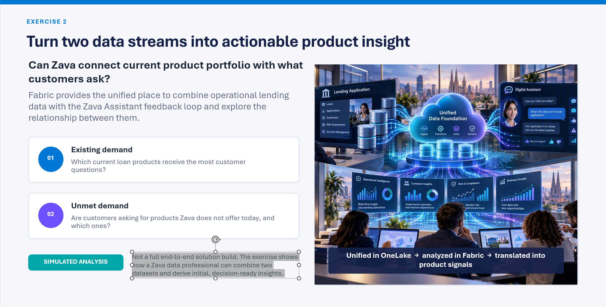

# How Zava uses Fabric to generate new business insights

In this part of the workshop we will demonstrate how Zava can further advance their business by combining data sets from mission-critical applications (running in Azure SQL) and newly created applications that they developed using Fabrci platform.

The following slides explain motivation and goal ("why and what") as well as high-level implementation using additional components of Fabric - Lakehouse, Notebooks, etc.

```text
Disclaimer: This is not a full end-to-end solution build exercise.
It shows how a Zava data professional (data analyst) can combine two datasets and derive initial, decision-ready insights.
```

## Motivation and goals



## Implementation flow


## Next steps

1. [Go to Exercises](Exercises/README.md)
